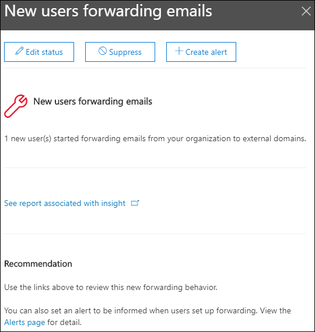

# 新用户在安全 & 合规中心转发电子邮件洞察力New users forwarding email insight in the Security & Compliance Center

当组织中的新用户帐户突然开始将电子邮件转发到外部域时，这是可疑的。It's suspicious when new user accounts in your organization suddenly start forwarding email messages to external domains.

当组织中新创建的用户将邮件转发给外部域时，**转发的新域的电子邮件**洞察力会通知您。The **New domains being forwarded email** insight notifies you when newly-created users in your organization are forwarding messages to external domains. 这种情况可能表示使用了已损坏的管理员帐户来创建新用户。This condition could indicate compromised admin accounts were used to create the new users. 如果您怀疑帐户已损坏，请参阅[响应已泄露的电子邮件帐户](https://docs.microsoft.com/microsoft-365/security/office-365-security/responding-to-a-compromised-email-account)。If you suspect the accounts have been compromised, see [Responding to a compromised email account](https://docs.microsoft.com/microsoft-365/security/office-365-security/responding-to-a-compromised-email-account).

此洞察力仅在检测到问题时显示，并显示在 "[转发报告](view-mail-flow-reports.md#forwarding-report)" 页上。This insight appears only when the issue is detected, and it appears on the [Forwarding report](view-mail-flow-reports.md#forwarding-report) page.

当您单击小组件时，将显示一个弹出对话框，可在其中找到有关转发邮件的更多详细信息，包括指向本主题后面所述的[转发修改报告](#forwarding-modifications-report)的链接。When you click on the widget, a flyout appears where you can find more details about the forwarded messages, including a link to the [Forwarding modifications report](#forwarding-modifications-report) as described later in this topic.

当您在 (**报告**仪表板 "或") 上的 "**热门见解 & 建议**" 区域中单击 "**查看全部**" 后，您还可以转到此详细信息页面 \> **Dashboard** <https://protection.office.com/insightdashboard> 。You can also get to this details page when you select the insight after you click **View all** in the **Top insights & recommendations** area on (**Reports** \> **Dashboard** or <https://protection.office.com/insightdashboard>).

您可以单击 "**查看与洞察力相关的报告**" 链接以转到 "**转发修改" 报告**，如下一节中所述。You can click the **See report associated with insight** link to go to the **Forwarding modifications report** as described in the next section.

## 转发修改报告Forwarding modifications report

"**转发修改" 报告**显示有关自动从组织中的发件人转发的邮件的详细信息：The **Forwarding modifications report** shows details about messages that are being automatically forwarded from senders in your organization:

- 将邮件转发到外部域的新创建的帐户。Newly-created accounts that are forwarding messages to external domains.
- 将邮件转发到组织中的其他发件人从未转发给外部域的帐户。Accounts that are forwarding messages to external domains that have never been forwarded to by other senders in your organization.

这些转发邮件类型可能会带来安全或合规性风险，并可能指示已泄露的帐户。These types of forwarded messages can pose a security or compliance risk, and might indicate compromised accounts.

此报告包含最长为90天的数据。The report contains data for up to 90 days. 默认情况下，此报告显示过去7天的数据。By default, the report shows data for the last 7 days.

此报告不能直接在[邮件流仪表板](mail-flow-insights-v2.md)或[报表仪表板](view-mail-flow-reports.md)中使用。This report isn't directly available in the [Mail flow dashboard](mail-flow-insights-v2.md) or in the [Reports dashboard](view-mail-flow-reports.md). 除了单击**新用户发送电子邮件**见解中的 "**查看与洞察力相关的查看报告**" 链接之外，您还可以通过以下方式获取报告：In addition to clicking the **See report associated with insight** link in the **New users forwarding email** insight, you get to the report by:

- 在要转发的新域的详细信息中单击 "**转发通知报告**" 链接，[了解如何理解电子邮件](mfi-new-domains-being-forwarded-email.md)。Clicking the **Forwarding notifications report** link in the details of the [New domains being forwarded email insight](mfi-new-domains-being-forwarded-email.md).
- 打开 <https://protection.office.com/reportv2?id=MailFlowNewForwarding> 。Opening <https://protection.office.com/reportv2?id=MailFlowNewForwarding>.

### "转发修改" 报告的报告视图Report view for the Forwarding modifications report

报表视图中提供了以下图表：The following charts are available in the report view:

- **显示以下项的数据：新的转发用户**：**Show data for: New forwarding users**:

  

- **显示以下项的数据：新的转发域**：**Show data for: New forwarding domains**:

  

如果您在报告视图中单击 "**筛选器**"，则可以指定具有 "**开始日期**" 和 "**结束日期**" 的日期范围。If you click **Filters** in a report view, you can specify a date range with **Start date** and **End date**.

### 转发修改报告的详细信息表格视图Details table view for the Forwarding modifications report

如果您单击 "**查看详细信息表**"，则显示的信息将取决于所查看的图表：If you click **View details table**, the information that's shown depends on the chart you were looking at:

- **显示以下项的数据：新的转发用户**：**Show data for: New forwarding users**:

  - **名称**：发件人的电子邮件地址。**Name**: The email address of the sender.
  - **转发类型****Forwarding type**
  - **收件人地址****Recipient address**
  - **详细信息****Details**
  - **Count****Count**
  - **第一次转发日期****First forward date**

- **显示以下项的数据：新的转发域**：**Show data for: New forwarding domains**:

  - **名称**：发件人的电子邮件域。**Name**: The email domain of the sender.
  - **转发类型****Forwarding type**
  - **收件人地址****Recipient address**
  - **详细信息****Details**
  - **Count****Count**
  - **第一次转发日期****First forward date**

如果单击 "详细信息" 表视图中的 "**筛选器**"，则可以指定具有 "**开始日期**" 和 "**结束日期**" 的日期范围。If you click **Filters** in a details table view, you can specify a date range with **Start date** and **End date**.

如果从表中选择行，则会显示**详细**信息弹出项，其中包含以下信息：If you select a row from the table, a **Details** flyout appears with the following information:

- **名称**：这是发件人的电子邮件地址 (来自**显示以下项的数据：新的转发用户**查看) 或发件人的电子邮件域 (来自**显示以下项的数据：新的转发域**视图) 。**Name**: This is either the sender's email address (from **Show data for: New forwarding users** view) or the sender's email domain (from **Show data for: New forwarding domains** view).
- **转发类型****Forwarding type**
- **收件人****Recipient**
- **详细信息****Details**
- **Count****Count**
- **开始日期****Start date**
- **建议**：在此，可以单击 "Microsoft 365 管理中心" 中的 "管理用户" 的链接。**Recommendation**: From here, you can click the link to manage the user in the Microsoft 365 admin center.

若要返回到 "报告" 视图，请单击 "**查看报告**"。To go back to the reports view, click **View report**.

## 相关主题Related topics

有关邮件流仪表板中的其他见解的信息，请参阅[Security & 合规性中心中的邮件流见解](mail-flow-insights-v2.md)。For information about other insights in the Mail flow dashboard, see [Mail flow insights in the Security & Compliance Center](mail-flow-insights-v2.md).
