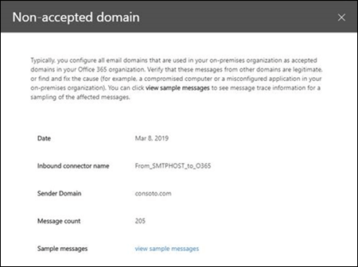

# 安全 & 合规中心中的非接受域报告

[Security & 合规性中心](https://protection.office.com)的[邮件流仪表板](mail-flow-insights-v2.md)中的**非接受域**报告显示有关内部部署电子邮件组织中的邮件的信息，其中发件人的域未配置为 Microsoft 365 组织中的接受域。

如果我们有数据来证明这些邮件的意图是恶意的，Microsoft 365 可能会对这些邮件进行限制。 因此，重要的是要了解所发生的情况并解决问题。

## 不接受的域报告的报告视图

单击 **不接受的域** 小组件上的图表将转到 **不接受的域** 报告。

默认情况下，将显示所有受影响的连接器的活动。 如果单击 " **显示数据**"，则可以从下拉列表中选择特定的连接器。

如果将鼠标悬停在图表中 (日) 上，您将看到连接器的邮件总数。

## 不接受的域报告的详细信息表格视图

如果您在报告视图中单击 " **查看详细信息表** "，将显示以下信息：

- **Date**
- **入站连接器名称**
- **发件人域**
- **邮件计数**
- **示例邮件**：受影响邮件的示例的邮件 id。

如果单击 "详细信息" 表视图中的 " **筛选器** "，则可以指定具有 " **开始日期** " 和 " **结束日期**" 的日期范围。

若要通过电子邮件将特定日期范围的报告发送给一个或多个收件人，请单击 " **请求下载**"。

当您在表中选择一行时，将显示一个包含以下信息的浮出控件：

- **Date**
- **入站连接器名称**
- **发件人域**
- **邮件计数**
- **示例邮件**：您可以单击 " **查看示例邮件** "，查看有关受影响邮件的示例的 [邮件跟踪](message-trace-scc.md) 结果。

若要返回到 "报告" 视图，请单击 " **查看报告**"。

## 相关主题

有关邮件流仪表板中的其他见解的信息，请参阅 [Security & 合规性中心中的邮件流见解](mail-flow-insights-v2.md)。
