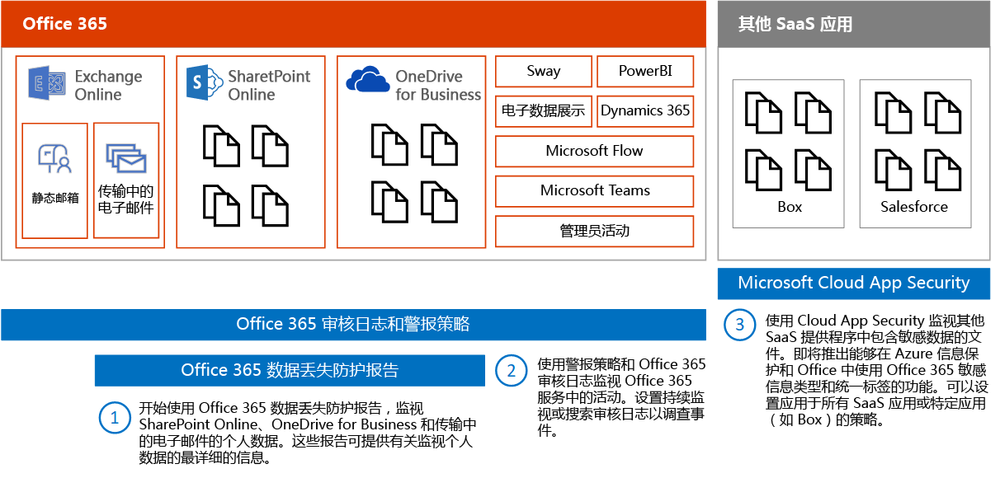
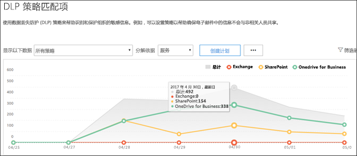
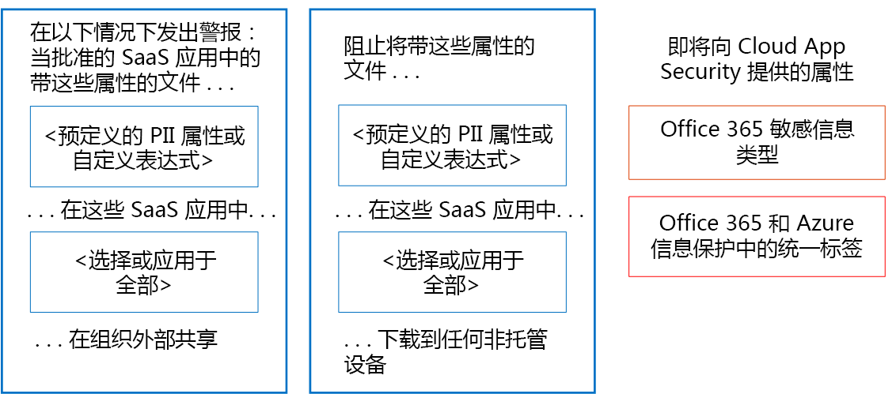

# 监视个人数据泄露Monitor for leaks of personal data

[!INCLUDE [Microsoft 365 Defender rebranding](../includes/microsoft-defender-for-office.md)]

有许多工具可用于监视个人数据的使用和传输。本主题介绍了三种十分有用的工具。There are many tools that can be used to monitor the use and transport of personal data. This topic describes three tools that work well.

在此图中：In the illustration:

- 从 Microsoft 365 数据丢失防护报告入手，它们用于监视 SharePoint Online、OneDrive for Business 和传输中的电子邮件内的个人数据。这些报告为监控个人数据提供了最详细的信息。然而，这些报告并未囊括 Office 365 中的所有服务。Start with Microsoft 365 data loss prevention reports for monitoring personal data in SharePoint Online, OneDrive for Business, and email in transit. These reports provide the greatest level of detail for monitoring personal data. However, these reports don't include all services in Office 365.

- 接下来，使用警报策略和审核日志监视服务中的活动。设置持续监视或搜索审核日志以调查事件。审核日志适用于以下服务：Sway、Power BI、电子数据展示、Dynamics 365、Microsoft Flow、Microsoft Teams、管理员活动、OneDrive for Business、SharePoint Online、传输中的邮件和静态邮箱。Skype 对话属于静态邮箱服务。Next, use alert policies and the audit log to monitor activity across services. Set up ongoing monitoring or search the audit log to investigate an incident. The audit log works across services—Sway, Power BI, eDiscovery, Dynamics 365, Microsoft Flow, Microsoft Teams, Admin activity, OneDrive for Business, SharePoint Online, mail in transit, and mailboxes at rest. Skype conversations are included in mailboxes at rest.

- 最后，使用 Microsoft Cloud App Security 监视其他 SaaS 提供程序中包含敏感数据的文件。即将推出的功能为，通过 Cloud App Security 跨 Azure 信息保护和 Office 使用敏感信息类型和统一标签。可以设置适用于所有 SaaS 应用或特定应用（如 Box）的策略。Cloud App Security 不会发现 Exchange Online 中的文件（包括附加到电子邮件的文件）。Finally, Use Microsoft Cloud App Security to monitor files with sensitive data in other SaaS providers. Coming soon is the ability to use sensitive information types and unified labels across Azure Information Protection and Office with Cloud App Security. You can set up policies that apply to all of your SaaS apps or specific apps (like Box). Cloud App Security doesn't discover files in Exchange Online, including files attached to email.

## 数据丢失防护报告Data loss prevention reports

创建数据丢失防护 (DLP) 策略后，你需要验证这些策略是否按预期运行，以及是否有助于你保持合规性。借助 Office 365 中的 DLP 报告，可以快速查看 DLP 策略匹配数、替代数或误报数；观察它们随时间推移是呈上升趋势还是下降趋势；以不同的方式筛选报告；以及通过选择图中直线上的点来查看更多详细信息。After you create your data loss prevention (DLP) policies, you'll want to verify that they're working as you intended and helping you to stay compliant. With the DLP reports in Office 365, you can quickly view the number of DLP policy matches, overrides, or false positives; see whether they're trending up or down over time; filter the report in different ways; and view more details by selecting a point on a line on the graph.

可以使用 DLP 报告实现以下目的：You can use the DLP reports to:

- 重点关注特定的时间段，并了解峰值和发展趋势的原因。Focus on specific time periods and understand the reasons for spikes and trends.

- 发现违反组织的 DLP 策略的业务流程。Discover business processes that violate your organization's DLP policies.

- 了解 DLP 策略的任何业务影响。Understand any business impact of the DLP policies.

- 查看用户在通过重写策略或报告误报解析策略提示时提交的理由。View the justifications submitted by users when they resolve a policy tip by overriding the policy or reporting a false positive.

- 通过显示该策略的匹配结果，验证该策略是否遵守特定 DLP 策略。Verify compliance with a specific DLP policy by showing any matches for that policy.

- 在详细信息窗格中查看与您的 DLP 策略相匹配的含敏感数据的文件列表。View a list of files with sensitive data that matches your DLP policies in the details pane.

此外，当你在测试模式下运行 DLP 策略时，可以使用 DLP 报告对其进行微调。In addition, you can use the DLP reports to fine-tune your DLP policies as you run them in test mode.

DLP 报告位于安全中心和合规中心中。DLP reports are in the security center and the compliance center. 导航到“报告”\>“查看报告”。Navigate to Reports \> View reports. 在“数据丢失防护 (DLP)”下，转到“DLP 策略和规则匹配项”或“DLP 误报和重写”。Under Data loss prevention (DLP), go to either DLP policy and rule matches or DLP false positives and overrides.

有关详细信息，请参阅[查看数据丢失防护报告](../../compliance/view-the-dlp-reports.md)。For more information, see [View the reports for data loss prevention](../../compliance/view-the-dlp-reports.md).

## 审核日志和警报策略audit log and alert policies

审核日志包含来自 Exchange Online、SharePoint Online、OneDrive for Business、Azure Active Directory、Microsoft Teams、Power BI、Sway 和其他服务的事件。The audit log contains events from Exchange Online, SharePoint Online, OneDrive for Business, Azure Active Directory, Microsoft Teams, Power BI, Sway, and other services.

安全中心和合规中心提供两种方法针对审核日志进行监视和报告：The security center and compliance center provide two ways to monitor and report against the audit log:

- 设置警报策略、查看警报和监视趋势 — 使用安全中心或合规中心中的警报策略和警报仪表板工具。Set up alert policies, view alerts, and monitor trends—Use the alert policy and alert dashboard tools in either the security center or compliance center.

- 直接搜索审核日志：搜索指定日期范围内的所有事件。也可以根据特定条件（如执行操作的用户、操作或目标对象）筛选结果。Search the audit log directly: Search for all events in a specified date rage. Or you can filter the results based on specific criteria, such as the user who performed the action, the action, or the target object.

信息安全和合规性团队可以使用这些工具主动审核服务中由最终用户和管理员执行的活动。可以配置自动警报，以便在特定网站集上发生某些活动时（例如从已知包含 GDPR 相关信息的网站共享内容时），发送电子邮件通知。此操作使这些团队可以跟踪用户，以确保遵守企业安全策略或提供额外培训。Information security and compliance teams can use these tools to proactively review activities performed by both end users and administrators across services. Automatic alerts can be configured to send email notifications when certain activities occur on specific site collections - for example when content is shared from sites known to contain GDPR-related information. This allows those teams to follow up with users to ensure that corporate security policies are followed, or to provide additional training.

信息安全团队还可以搜索审核日志来调查可疑的数据泄露并确定泄露的根本原因和程度。此内置功能有助于遵守 GDPR 条款 33 和 34 的规定，其中要求在特定时间段内向 GDPR 监管机构和数据泄露的数据主体自身提供通知。通常的建议是，仅将审核日志条目在服务内保留 90 天，但许多组织都要求将这些日志保留更长的时间。Information security teams can also search the audit log to investigate suspected data breaches and determine both root cause and the extent of the breach. This built-in capability facilitates compliance with article 33 and 34 of the GDPR, which require notifications be provided to the GDPR supervisory authority and to the data subjects themselves of a data breach within a specific time period. Audit log entries are only retained for 90 days within the service - it is often recommended and many organizations required that these logs be retained for longer periods of time.

有些解决方案可以通过 Microsoft 管理活动 API 来订阅统一审核日志，而且可以按需存储日志条目并提供高级仪表板和警报。例如：[Microsoft Operations Management Suite (OMS)](https://docs.microsoft.com/azure/operations-management-suite/oms-solution-office-365)。Solutions are available that subscribe to the Unified Audit Logs through the Microsoft Management Activity API and can both store log entries as needed, and provide advanced dashboards and alerts. One example is [Microsoft Operations Management Suite (OMS)](https://docs.microsoft.com/azure/operations-management-suite/oms-solution-office-365).

有关警报策略和搜索审核日志的更多信息：More information about alert policies and searching the audit log:

- [Microsoft 365 安全与合规中心中的警报策略Alert policies in the Microsoft 365 security and compliance centers](../../compliance/alert-policies.md)

- [在 Office 365 中搜索用户和管理员活动的审核日志](../../compliance/search-the-audit-log-in-security-and-compliance.md)（介绍）[Search the audit log for user and admin activity in Office 365](../../compliance/search-the-audit-log-in-security-and-compliance.md) (introduction)

- [启用或禁用审核日志搜索Turn audit log search on or off](../../compliance/turn-audit-log-search-on-or-off.md)

- [搜索审核日志Search the audit log](../../compliance/search-the-audit-log-in-security-and-compliance.md)

- [Search-UnifiedAuditLog](https://docs.microsoft.com/powershell/module/exchange/search-unifiedauditlog) (cmdlet)[Search-UnifiedAuditLog](https://docs.microsoft.com/powershell/module/exchange/search-unifiedauditlog) (cmdlet)

- [审核日志中的详细属性Detailed properties in the audit log](../../compliance/detailed-properties-in-the-office-365-audit-log.md)

## Microsoft Cloud App SecurityMicrosoft Cloud App Security

Microsoft Cloud App Security 可帮助你跨网络发现使用中的其他 SaaS 应用、发送到这些应用的敏感数据以及从这些应用发送的敏感数据。Microsoft Cloud App Security helps you discover other SaaS apps in use across your networks and sensitive data sent to and from these apps.

Microsoft Cloud App Security 是一项可为云应用提供深层可见性、细化控制和增强型威胁防护的综合服务。它可以在你的网络中（从所有设备）识别出超过 15,000 个云应用程序，并提供风险评分以及持续的风险评估和分析。无需代理：从你的防火墙和代理收集信息，从而为你提供有关云使用情况和影子 IT 的完整可见性和上下文。Microsoft Cloud App Security is a comprehensive service providing deep visibility, granular controls, and enhanced threat protection for your cloud apps. It identifies more than 15,000 cloud applications in your network-from all devices-and provides risk scoring and ongoing risk assessment and analytics. No agents required: information is collected from your firewalls and proxies to give you complete visibility and context for cloud usage and shadow IT.

为了更好地了解云环境，Cloud App Security 调查功能可让你深入了解批准的应用和托管的应用的所有活动、文件和帐户。你可以获得文件级别的详细信息，并发现数据在云应用中的传输位置。To better understand your cloud environment, the Cloud App Security investigate feature provides deep visibility into all activities, files, and accounts for sanctioned and managed apps. You can gain detailed information on a file level and discover where data travels in the cloud apps.

例如，下图说明了有助于符合 GDPR 的两个 Cloud App Security 策略。For examples, the following illustration demonstrates two Cloud App Security policies that can help with GDPR.

如果选择的文件包含预定义的 PII 属性或自定义表达式，并且从选择的 SaaS 应用组织外部共享，那么第一个策略发出警报。The first policy alerts when files with a predefined PII attribute or custom expression that you choose is shared outside the organization from the SaaS apps that you choose.

第二个策略会阻止将文件下载到任何非托管设备。选择要查找的文件内的属性以及需要对其应用策略的 SaaS 应用。The second policy blocks downloads of files to any unmanaged device. You choose the attributes within the files to look for and the SaaS apps you want the policy to apply to.

即将向 Cloud App Security 提供以下属性类型：These attribute types are coming soon to Cloud App Security:

- 敏感信息类型Sensitive information types
- Microsoft 365 和 Azure 信息保护中的统一标签Unified labels across Microsoft 365 and Azure Information Protection

### Cloud App Security 仪表板Cloud App Security dashboard

如果尚未开始使用 Cloud App Security，那就开始吧。Cloud App Security 的访问网址为 <https://portal.cloudappsecurity.com>。If you haven't yet started to use Cloud App Security, begin by starting it up. To access Cloud App Security: <https://portal.cloudappsecurity.com>.

注意：开始使用 Cloud App Security 时或在分配标签前，请务必启用“自动扫描文件中是否有 Azure 信息保护分类标签”（位于“常规”设置中）。设置后，Cloud App Security 不会再次扫描现有文件，除非它们遭到修改。Note: Be sure to enable 'Automatically scan files for Azure Information Protection classification labels' (in General settings) when getting started with Cloud App Security or before you assign labels. After setup, Cloud App Security does not scan existing files again until they are modified.

详细信息：More information:

- [部署 Cloud App SecurityDeploy Cloud App Security](https://docs.microsoft.com/cloud-app-security/getting-started-with-cloud-app-security)

- [有关 Microsoft Cloud App Security 的更多信息More information about Microsoft Cloud App Security](https://www.microsoft.com/cloud-platform/cloud-app-security)

- [使用 Microsoft Cloud App Security 代理阻止下载敏感信息Block downloads of sensitive information using the Microsoft Cloud App Security proxy](https://docs.microsoft.com/cloud-app-security/use-case-proxy-block-session-aad)

## 用于检测个人数据共享的示例文件和活动策略Example file and activity policies to detect sharing of personal data

### 检测包含 PII 的文件共享 — 信用卡卡号Detect sharing of files containing PII — Credit card number

从批准的云应用共享包含信用卡卡号的文件时发出警报。Alert when a file containing a credit card number is shared from an approved cloud app.

****

|控件Control|设置Settings|
|---|---|
|策略类型Policy type|文件策略File policy|
|策略模板Policy template|无模板No template|
|策略严重性Policy severity|高High|
|类别Category|DLPDLP|
|筛选设置Filter settings|访问级别 = 公共 (Internet)，公共，外部Access level = Public (Internet), Public, External 
 应用 = \<select apps\>（如果想要将监视限制为特定 SaaS 应用，请使用此设置）App = \<select apps\> (use this setting if you want to limit monitoring to specific SaaS apps)|
|应用对象Apply to|所有文件、所有的所有者All files, all owners|
|内容检查Content inspection|包括匹配当前表达式的文件：所有国家/地区：法国：信用卡卡号Includes files that match a present expression: All countries: Finance: Credit card number 
 无需相关上下文：未选中（此设置将匹配关键字和正则表达式）Don't require relevant context: unchecked (this setting will match keywords as well as regex) 
 包括具有至少 1 个匹配项的文件Includes files with at least 1 match 
 取消屏蔽冲突的最后 4 个字符：已选中Unmask the last 4 characters of the violation: checked|
|警报Alerts|为每个匹配文件创建警报：已选中Create an alert for each matching file: checked 
 每日警报限制：1000Daily alert limit: 1000 
 选择一个警报作为电子邮件：已选中Select an alert as email: checked 
 收件人：infosec@contoso.comTo: infosec@contoso.com|
|治理Governance|Microsoft OneDrive for BusinessMicrosoft OneDrive for Business 
 设为专用：选中“删除外部用户”Make private: check Remove External Users 
 所有其他设置：未选中All other settings: unchecked 
 Microsoft SharePoint OnlineMicrosoft SharePoint Online 
 设为专用：选中“删除外部用户”Make private: check Remove External Users 
 所有其他设置：未选中All other settings: unchecked|
|

类似策略：Similar policies:

- 检测包含 PII 的文件共享 — 电子邮件地址Detect sharing of Files containing PII - Email Address
- 检测包含 PII 的文件共享 — 护照编号Detect sharing of Files containing PII - Passport Number

### 检测 Box 或 OneDrive for Business 中的客户或 HR 数据Detect Customer or HR Data in Box or OneDrive for Business

当标记为“客户数据”或“HR 数据”的文件上传至 OneDrive for Business 或 Box 时发出警报。Alert when a file labeled as Customer Data or HR Data is uploaded to OneDrive for Business or Box.

注意：Notes:

- Box 监视要求使用 API 连接器 SDK 配置连接器。Box monitoring requires a connector be configured using the API Connector SDK.
- 此策略需要当前为个人预览版的功能。This policy requires capabilities that are currently in private preview.

****

|控件Control|设置Settings|
|---|---|
|策略类型Policy type|活动策略Activity policy|
|策略模板Policy template|无模板No template|
|策略严重性Policy severity|高High|
|类别Category|共享控制Sharing Control|
|作用对象Act on|单个活动Single activity|
|筛选设置Filter settings|活动类型 = 上传文件Activity type = Upload File 
 应用 = Microsoft OneDrive for Business 和 BoxApp = Microsoft OneDrive for Business and Box 
 分类标签（目前为个人预览版）：Azure 信息保护 = 客户数据、人力资源—薪资数据、人力资源—员工数据Classification Label (currently in private preview): Azure Information Protection = Customer Data, Human Resources—Salary Data, Human Resources—Employee Data|
|警报Alerts|创建警报：已选中Create an alert: checked 
 每日警报限制：1000Daily alert limit: 1000 
 选择一个警报作为电子邮件：已选中Select an alert as email: checked 
 收件人：infosec@contoso.comTo: infosec@contoso.com|
|治理Governance|所有应用All apps 
 隔离用户：选中Put user in quarantine: check 
 所有其他设置：未选中All other settings: unchecked 
 Office 365Office 365 
 隔离用户：选中Put user in quarantine: check 
 所有其他设置：未选中All other settings: unchecked|
|

类似策略：Similar policies:

- 检测大量下载客户数据或 HR 数据的情况 — 如果检测到单个用户在较短的一段时间内下载了大量包含客户数据或 HR 数据的文件，则发出警报。Detect large downloads of Customer data or HR Data—Alert when a large number of files containing customer data or HR data have been detected being downloaded by a single user within a short period of time.
- 检测共享客户和 HR 数据的情况 — 共享包含客户或 HR 数据的文件时发出警报。Detect Sharing of Customer and HR Data—Alert when files containing Customer or HR Data are shared.
