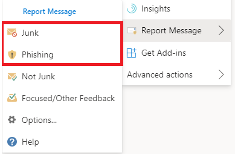
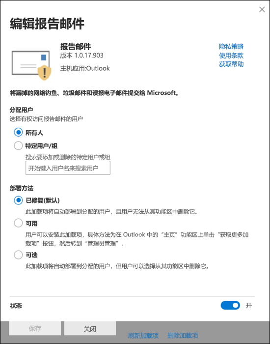

# 在 Outlook 中报告误报和漏报

[!INCLUDE [Microsoft 365 Defender rebranding](../includes/microsoft-defender-for-office.md)]

**适用对象**
- [Exchange Online Protection](exchange-online-protection-overview.md)
- [Microsoft Defender for Office 365 计划 1 和计划 2](defender-for-office-365.md)
- [Microsoft 365 Defender](../defender/microsoft-365-defender.md)

> [!NOTE]
> 如果你是具有 Exchange Online 邮箱的 Microsoft 365 组织的管理员，我们建议你使用安全与合规中心中的&门户。 有关详细信息，请参阅使用[管理员提交将可疑的垃圾邮件、网络钓鱼、URL 和文件提交到 Microsoft。](admin-submission.md)

在具有 Exchange Online 邮箱的 Microsoft 365 组织中或使用混合新式身份验证本地邮箱中，你可以向 Exchange Online Protection (EOP) 提交误报 (标记为垃圾邮件) 和误报 (错误电子邮件和网络钓鱼) 。

## 使用"报告邮件"功能之前要记住的一些内容

- 为了获得最佳用户提交体验，请使用报告邮件外接程序或报告网络钓鱼外接程序。

- 请注意，此外接程序适用于所有平台（Web、iOS、Android 和桌面版）中的 Outlook。

- 如果你是具有 Exchange Online 邮箱的组织管理员，请使用安全与合规中心中的&门户。 有关详细信息，请参阅使用[管理员提交将可疑的垃圾邮件、网络钓鱼、URL 和文件提交到 Microsoft。](admin-submission.md)

- 您可以配置为直接向 Microsoft 和/或您指定的邮箱发送邮件。 有关详细信息，请参阅用户 [提交策略](user-submission.md)。

- 有关向 Microsoft 报告邮件的信息，请参阅 [向 Microsoft 报告邮件和文件](report-junk-email-messages-to-microsoft.md)。

## 使用"报告邮件"功能

### 报告垃圾邮件和钓鱼邮件

对于收件箱或其他任何电子邮件文件夹中的邮件（垃圾邮件除外），请使用以下方法报告垃圾邮件和网络钓鱼邮件：

1. 单击 **选定邮件** 右上角的"更多操作"省略号，从下拉菜单中单击"报告邮件"，然后选择"**垃圾邮件**"或"网络钓鱼 **"。**
  
   > [!div class="mx-imgBorder"]
   > 

   > [!div class="mx-imgBorder"]
   > 

2. 选定的邮件将发送给 Microsoft 进行分析，并：

   - 如果报告为垃圾邮件，则移动到"垃圾邮件"文件夹。

   - 如果报告为网络钓鱼，则将其删除。
   
### 报告非垃圾邮件

1. 单击 **选定邮件** 右上角的"更多操作"省略号，单击下拉菜单中的"报告邮件"，然后单击"非 **垃圾邮件"。**  

   > [!div class="mx-imgBorder"]
   > 

   > [!div class="mx-imgBorder"]
   > 

2. 选定的邮件将被发送到 Microsoft 进行分析，并移动到收件箱或其他任何指定的文件夹。

## 启用"报告邮件"和"报告网络钓鱼"外接程序

Outlook 和 Web 上的 Outlook 的"报告邮件"和"报告网络钓鱼"外接程序 (以前称为 Outlook Web App) ，使用户能够轻松地将误报 (良好电子邮件报告为错误) 或漏报 (允许) 向 Microsoft 及其关联公司报告错误电子邮件进行分析。 

Microsoft 使用这些提交来提高电子邮件保护技术的有效性。 例如，假设用户正在使用报告网络钓鱼外接程序报告许多邮件。 此信息在安全仪表板和其他报告中显示。 组织的安全团队可以使用此信息指示可能需要更新反网络钓鱼策略。 

可以安装"报告邮件"或"报告钓鱼邮件"加载项。 如果希望用户同时报告垃圾邮件和网络钓鱼邮件，请在你的组织中部署报告邮件外接程序。 有关详细信息，请参阅启用报告邮件外接程序。 

报告邮件外接程序提供报告垃圾邮件和网络钓鱼邮件的选项。 管理员可以为组织启用"报告邮件"外接程序，并且各个用户可以自行安装它。 

报告网络钓鱼外接程序提供仅报告网络钓鱼邮件的选项。 管理员可以为组织启用报告网络钓鱼外接程序，并且单个用户可以自行安装它。 

如果您是单个用户，您可以为自己启用这两个外接程序。

f 你是全局管理员或 Exchange Online 管理员，并且 Exchange 配置为使用 OAuth 身份验证，你可以为组织启用报告邮件外接程序和报告网络钓鱼外接程序。 这两个加载项现在都可以通过集中 [部署获得](../../admin/manage/centralized-deployment-of-add-ins.md)。

## 开始前，有必要了解什么？

- 报告邮件外接程序和报告网络钓鱼外接程序适用于大多数 Microsoft 365 订阅和以下产品：

  - Outlook 网页版
  - Outlook 2013 SP1 或更高版本
  - Outlook 2016 for Mac
  - Microsoft 365 企业应用版中包含的 Outlook
  - 适用于 iOS 和 Android 的 Outlook 应用

- 这两个加载项均不适用于本地 Exchange 组织的共享邮箱或邮箱。

- 现有的 Web 浏览器应同时使用报告邮件和报告钓鱼外接程序。但是，如果您注意到外接程序不可用或未正常工作，请尝试其他浏览器。

- 对于组织安装，组织需要配置为使用 OAuth 身份验证。 有关详细信息，请参阅确定加载项的集中部署 [是否适用于你的组织](../../admin/manage/centralized-deployment-of-add-ins.md)。

- 管理员需为全局管理员角色组的成员。 有关详细信息，请参阅[安全与合规中心中的权限](permissions-in-the-security-and-compliance-center.md)。

## 获取报告邮件外接程序

### 自己获取外接程序

1. 转到 Microsoft AppSource ， <https://appsource.microsoft.com/marketplace/apps> 然后搜索"报告消息"加载项。 若要直接转到"报告邮件"加载项，请转到 <https://appsource.microsoft.com/product/office/wa104381180> 。

2. 单击 **"立即获取"。**

   

3. 在出现的对话框中，查看使用条款和隐私策略，然后单击"继续 **"。**

4. 使用工作或学校帐户登录 (商业用途) Microsoft 帐户 (供个人) 。

安装并启用加载项后，你将看到以下图标：

- 在 Outlook 中，图标如下所示：

  > [!div class="mx-imgBorder"]
  > 

- 在 Outlook 网页 Outlook 中，图标如下所示：

  > [!div class="mx-imgBorder"]
  > 

### 获取组织的外接程序

> [!NOTE]
> 外接程序可能需要 12 个小时才能显示在组织中。

1. 在 Microsoft 365 管理中心中，转到 "设置" \> **"加载项"** 页面，位于 <https://admin.microsoft.com/AdminPortal/Home#/Settings/AddIns> 。 如果看不到"加载项 **"页面，** 请转到"集成应用"页面顶部的"设置 \>  \> ""集成应用""加载项 **"** 链接。

2. 选择 **页面顶部的"** 部署外接程序"，然后选择"下一步 **"。**

   

3. 在出现的 **"部署新的外接程序"** 飞出中，查看信息，然后单击"下一步 **"。**

4. 下一页上，单击 **从应用商店中选择**。

   

5. 在出现的 **"选择外接程序"** 页中，单击"搜索"框中，输入"**报告** 邮件"，然后单击"**搜索搜索"**  。 在结果列表中，找到"**报告邮件**"，然后单击"添加 **"。**

   

6. 在出现的对话框中，查看许可和隐私信息，然后单击"继续 **"。**

7. 在 **出现的"配置外接程序"** 页中，配置以下设置：

   - **已分配用户**：选择下列值之一：

     - **每个人都** (默认) 
     - **特定用户/组**
     - **就我自己**

   - **部署方法**：选择下列值之一：

     - **修复 (默认) ：** 加载项会自动部署到指定用户，且无法删除。
     - **可用**：用户可以在"主页""获取加载项 \> **""管理员管理**" \> **中安装加载项**。
     - **可选**：外接程序将自动部署到指定用户，但他们可以选择将其删除。

   

   完成后，单击"部署 **"。**

8. 在 **出现的"** 部署报告消息"页中，你将看到一个进度报告，然后确认外接程序已部署。 阅读信息后，单击"下一 **步"。**

   

9. 在出现的 **"宣布外接程序"** 页上，查看信息，然后单击"关闭 **"。**

   

## 查看或编辑报告邮件外接程序的设置

1. 在 Microsoft 365 管理中心中，转到 "设置" \> **"加载项"** 页面，位于 <https://admin.microsoft.com/AdminPortal/Home#/Settings/AddIns> 。 如果看不到"加载项 **"页面，** 请转到"集成应用"页面顶部的"设置 \>  \> ""集成应用""加载项 **"** 链接。

   

2. 查找并选择 **"报告邮件** "外接程序。

3. 在出现的 **"编辑报告** 消息"飞出控件中，根据组织情况查看和编辑设置。 完成后，单击“保存”。

   

## 获取报告网络钓鱼外接程序

### 自己获取外接程序

1. 转到 Microsoft AppSource， <https://appsource.microsoft.com/marketplace/apps> 然后搜索"报告钓鱼"加载项。

2. 单击 **"立即获取"。**

3. 在出现的对话框中，查看使用条款和隐私策略，然后单击"继续 **"。**

4. 使用工作或学校帐户登录 (商业用途) Microsoft 帐户 (供个人) 。

安装并启用加载项后，你将看到以下图标：

- 在 Outlook 中，图标如下所示：

  

- 在 Outlook 网页 Outlook 中，图标如下所示：

  > [!div class="mx-imgBorder"]
  > 

### 获取组织的外接程序

> [!NOTE]
> 外接程序可能需要 12 个小时才能显示在组织中。

1. 在 Microsoft 365 管理中心中，转到 "设置" \> **"加载项"** 页面，位于 <https://admin.microsoft.com/AdminPortal/Home#/Settings/AddIns> 。 如果看不到"加载项 **"页面，** 请转到"集成应用"页面顶部的"设置 \>  \> ""集成应用""加载项 **"** 链接。

2. 选择 **页面顶部的"** 部署外接程序"，然后选择"下一步 **"。**

   

3. 在出现的 **"部署新的外接程序"** 飞出中，查看信息，然后单击"下一步 **"。**

4. 下一页上，单击 **从应用商店中选择**。

   

5. 在出现的 **"选择外接程序"** 页中，单击"搜索"框中，输入"**报告网络钓鱼"，** 然后单击"**搜索搜索"**  。 在结果列表中，找到"**报告网络钓鱼"，** 然后单击"添加 **"。**

6. 在出现的对话框中，查看许可和隐私信息，然后单击"继续 **"。**

7. 在 **出现的"配置外接程序"** 页中，配置以下设置：

   - **已分配用户**：选择下列值之一：

     - **每个人都** (默认) 
     - **特定用户/组**
     - **就我自己**

   - **部署方法**：选择下列值之一：

     - **修复 (默认) ：** 加载项会自动部署到指定用户，且无法删除。
     - **可用**：用户可以在"主页""获取加载项 \> **""管理员管理**" \> **中安装加载项**。
     - **可选**：外接程序将自动部署到指定用户，但他们可以选择将其删除。

   完成后，单击"部署 **"。**

8. 在 **出现的"部署** 报告网络钓鱼"页中，你将看到一个进度报告，然后确认外接程序已部署。 阅读信息后，单击"下一 **步"。**

9. 在出现的 **"宣布外接程序"** 页上，查看信息，然后单击"关闭 **"。**

## 查看或编辑报告网络钓鱼外接程序的设置

1. 在 Microsoft 365 管理中心中，转到 "设置" \> **"加载项"** 页面，位于 <https://admin.microsoft.com/AdminPortal/Home#/Settings/AddIns> 。 如果看不到"加载项 **"页面，** 请转到"集成应用"页面顶部的"设置 \>  \> ""集成应用""加载项 **"** 链接。

2. 查找并选择报告 **网络钓鱼** 外接程序。

3. 在出现的 **"编辑报告** 钓鱼"飞出控件中，查看和编辑适合你的组织的设置。 完成后，单击“保存”。

## 查看和查看报告的邮件

若要查看用户报告给 Microsoft 的邮件，可以使用以下选项：

- 使用管理员提交门户。 有关详细信息，请参阅查看 [Microsoft 的用户提交](admin-submission.md#view-user-submissions-to-microsoft)。

- 创建邮件流规则 (也称为传输规则) 传输规则，以发送报告的邮件的副本。 有关说明，请参阅 [使用邮件流规则查看用户向 Microsoft 报告哪些内容](use-mail-flow-rules-to-see-what-your-users-are-reporting-to-microsoft.md)。