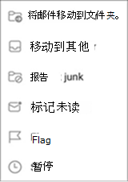

# 在 Exchange Online 中的 Outlook for iOS 和 Outlook for Android 中报告垃圾邮件和网络钓鱼电子邮件

[!INCLUDE [Microsoft 365 Defender rebranding](../includes/microsoft-defender-for-office.md)]

在使用 [混合新式身份验证](https://docs.microsoft.com/microsoft-365/enterprise/hybrid-modern-auth-overview?view=o365-worldwide)的 Exchange Online 或本地邮箱中具有邮箱的 Microsoft 365 组织中，您可以使用 Outlook for IOS 和 Outlook for Android 中的内置报告选项来提交误报 (良好的电子邮件，并将其标记为垃圾邮件) 、漏报 (错误的电子邮件) 并将网络钓鱼邮件发送到 Exchange Online PROTECTION (EOP) 。

## 在开始之前，您需要知道什么

- 如果您是具有 Exchange Online 邮箱的组织中的管理员，我们建议您在安全 & 合规性中心中使用提交门户。 有关详细信息，请参阅 [使用管理员提交将可疑的垃圾邮件、网络钓鱼、url 和文件提交给 Microsoft](admin-submission.md)。

- 您可以将报告的邮件配置为复制或重定向到您指定的邮箱。 有关详细信息，请参阅 [在 Exchange Online 中指定用户提交垃圾邮件和网络钓鱼邮件的邮箱](user-submission.md)。

- 有关向 Microsoft 报告邮件的详细信息，请参阅 [将邮件和文件报告给 microsoft](report-junk-email-messages-to-microsoft.md)。

  > [!NOTE]
  > 如果在用户提交策略中禁用了 Outlook 的垃圾邮件报告功能，则垃圾邮件或仿冒邮件将移至 "垃圾邮件" 文件夹，而不会报告给您的管理员或 Microsoft。

## 在 Outlook for iOS 和 Outlook for Android 中报告垃圾邮件和网络钓鱼邮件

对于收件箱中的邮件，或除垃圾邮件以外的任何其他电子邮件文件夹，请使用以下步骤报告 iOS 和 Android 的垃圾邮件和网络钓鱼邮件：

1. 选择一个或多个邮件。
2. 在右上角点击三个垂直点。 将打开 "操作" 菜单。

   

3. 点击 " **报告垃圾邮件** "，然后选择 " **垃圾邮件** 或 **网络钓鱼**"。

   

4. 在出现的对话框中，可以选择 " **报告** " 或 " **无感谢**"。 如果选择 " **否**"，则如果你攻出了 **垃圾** 邮件，如果你点击了 "垃圾 **邮件" 文件夹** ，则会将邮件移动到 "已删除邮件" 文件夹。 选择 " **报告** "，同时将邮件的副本发送给 Microsoft。

   

如果你改变主意，请在出现的 toast 通知中选择 " **撤消** "。 邮件将保留在 "收件箱" 文件夹中。

## 从 Outlook for iOS 和 Outlook for Android 中的 "垃圾邮件" 文件夹报告非垃圾邮件

在 "垃圾邮件" 文件夹中，使用以下步骤报告垃圾邮件误报：

1. 选择一个或多个邮件。
2. 在右上角点击三个垂直点。 将打开 "操作" 菜单。

   

3. 点击 " **非垃圾邮件**"。

出现 toast 通知，表明电子邮件已移动到您的收件箱。 如果你改变主意，请在 toast 通知上选择 " **撤消** "。 电子邮件仍保留在 "垃圾邮件" 文件夹中。
