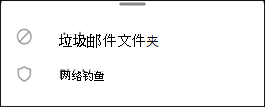

# 在 Exchange Online 中报告 Outlook for iOS 和 Outlook for Android 中的垃圾邮件和网络钓鱼电子邮件Report junk and phishing email in Outlook for iOS and Android in Exchange Online

[!INCLUDE [Microsoft 365 Defender rebranding](../includes/microsoft-defender-for-office.md)]

**适用于****Applies to**
- [Exchange Online ProtectionExchange Online Protection](https://go.microsoft.com/fwlink/?linkid=2148611)
- [Microsoft Defender for Office 365 计划 1 和计划 2Microsoft Defender for Office 365 plan 1 and plan 2](https://go.microsoft.com/fwlink/?linkid=2148715)
- [Microsoft 365 DefenderMicrosoft 365 Defender](https://go.microsoft.com/fwlink/?linkid=2118804)

在使用混合新式身份验证的 Exchange Online 或本地邮箱的 Microsoft 365 组织中，可以使用 Outlook for iOS 和 Outlook for Android 中的内置报告选项向 Exchange Online Protection (EOP) 提交误报 (标记为垃圾邮件) 、漏报 (允许的) 错误电子邮件以及网络钓鱼邮件。 In Microsoft 365 organizations with mailboxes in Exchange Online or on-premises mailboxes using [hybrid modern authentication](https://docs.microsoft.com/microsoft-365/enterprise/hybrid-modern-auth-overview), you can use the built-in reporting options in Outlook for iOS and Android to submit false positives (good email marked as spam), false negatives (bad email allowed), and phishing messages to Exchange Online Protection (EOP).

## 开始之前，您需要了解哪些信息What do you need to know before you begin

- 如果你是具有 Exchange Online 邮箱的组织的管理员，我们建议你使用安全与合规中心&门户。If you're an admin in an organization with Exchange Online mailboxes, we recommend that you use the Submissions portal in the Security & Compliance Center. 有关详细信息，请参阅"使用管理员提交"将可疑的垃圾邮件、网络钓鱼[、URL 和文件提交到 Microsoft。](admin-submission.md)For more information, see [Use Admin Submission to submit suspected spam, phish, URLs, and files to Microsoft](admin-submission.md).

- 可以将报告的邮件配置为复制或重定向到指定的邮箱。You can configure reported messages to be copied or redirected to a mailbox that you specify. 有关详细信息，请参阅用户 [提交策略](user-submission.md)。For more information, see [User Submissions policies](user-submission.md).

- 有关向 Microsoft 报告邮件详细信息，请参阅向 [Microsoft 报告邮件和文件](report-junk-email-messages-to-microsoft.md)。For more information about reporting messages to Microsoft, see [Report messages and files to Microsoft](report-junk-email-messages-to-microsoft.md).

  > [!NOTE]
  > 如果在用户提交策略中禁用了 Outlook 的垃圾邮件报告，垃圾邮件或网络钓鱼邮件将移动到"垃圾邮件"文件夹，并且不会报告给管理员或 Microsoft。If junk email reporting is disabled for Outlook in the user submission policy, junk or phishing messages will be moved to the Junk folder and not reported to your admin or Microsoft.

## 在 Outlook for iOS 和 Outlook for Android 中报告垃圾邮件和网络钓鱼邮件Report spam and phishing messages in Outlook for iOS and Android

对于收件箱中的邮件或其他任何电子邮件文件夹（垃圾邮件除外），请使用以下步骤报告 iOS 和 Android 的垃圾邮件和网络钓鱼邮件：For messages in the Inbox, or any other email folder except Junk Email, use the following steps to report spam and phishing messages for iOS and Android:

1. 选择一个或多个邮件。Select one or more messages.
2. 在右上角点击三个垂直点。In the top-right corner tap on the three vertical dots. 操作菜单将打开。The action menu opens.

   

3. 点击 **"报告垃圾邮件**"，然后选择"**垃圾邮件**"或"**网络钓鱼"。**Tap **Report junk** and then select **Junk** or **Phishing**.

   

4. 在出现的对话框中， **可以选择"报告** "或" **否"。谢谢**。In the dialog that appears, you can choose **Report** or **No Thanks**. 选择"**否"时**，如果点击"垃圾邮件"，邮件将移动到"垃圾邮件"文件夹，如果点击了网络钓鱼，邮件将移动到"已删除邮件"文件夹。On selecting **No Thanks**, if you tapped **Junk** the message moves to the Junk Email folder, if you tapped **Phishing** the message moves to the Deleted Items folder. Select **Report** to also send a copy of the message to Microsoft.Select **Report** to also send a copy of the message to Microsoft.

   

如果改变主意，请在出现的 Toast 通知上选择"撤消"。 If you change your mind, select **Undo** on the toast notification that appears. 邮件仍保留在收件箱文件夹中。The message remains in the Inbox folder.

## 从 Outlook for iOS 和 Outlook for Android 中的"垃圾邮件"文件夹报告非垃圾邮件Report non-spam messages from the Junk folder in Outlook for iOS and Android

在"垃圾邮件"文件夹中，使用以下步骤报告垃圾邮件误报：In the Junk folder, use the following steps to report spam false positives:

1. 选择一个或多个邮件。Select one or more messages.
2. 在右上角点击三个垂直点。In the top-right corner tap on the three vertical dots. 操作菜单将打开。The action menu opens.

   

3. 点击 **"非垃圾邮件"。**Tap **Not junk**.

将显示一个 Toast 通知，表明电子邮件已移动到收件箱。A toast notification appears that the email has moved to your Inbox. 如果改变主意，请选择 **Toast** 通知上的"撤消"。If you change your mind, select **Undo** on the toast notification. 电子邮件仍保留在"垃圾邮件"文件夹中。The email remains in the Junk folder.
