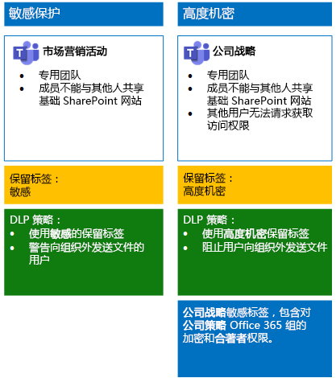
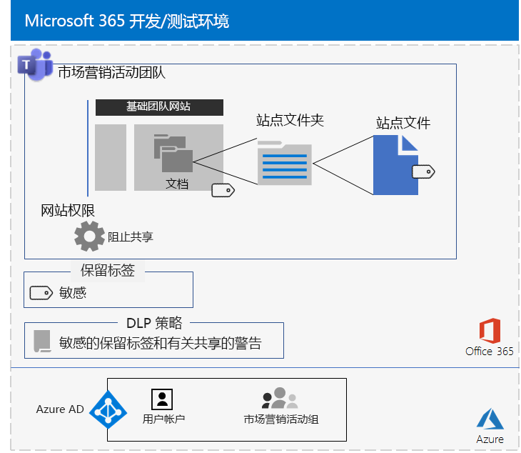
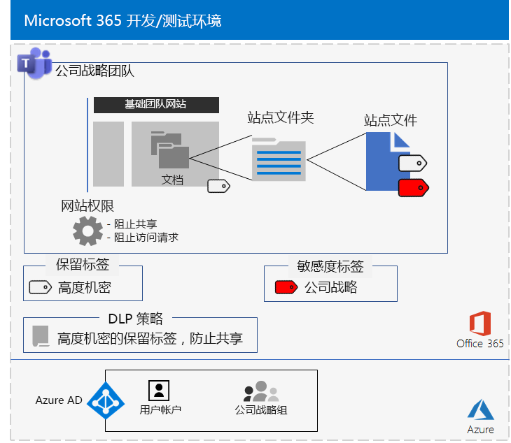

# <a name="secure-teams-for-files-in-a-devtest-environment"></a><span data-ttu-id="a3576-103">为开发/测试环境中的文件提供安全的团队</span><span class="sxs-lookup"><span data-stu-id="a3576-103">Secure Teams for files in a dev/test environment</span></span>

<span data-ttu-id="a3576-104">本文提供了创建开发/测试环境的分步说明，包括为[保护 Microsoft Teams 中的文件](secure-files-in-teams.md)解决方案提供敏感和高度机密团队。</span><span class="sxs-lookup"><span data-stu-id="a3576-104">This article provides step-by-step instructions to create a dev/test environment that includes the sensitive and highly confidential teams for the [Secure files in Microsoft Teams](secure-files-in-teams.md) solution.</span></span>
  

  
<span data-ttu-id="a3576-106">在生产中部署这些类型的团队前，可使用此开发/测试环境试验和微调设置以满足你的特定需求。</span><span class="sxs-lookup"><span data-stu-id="a3576-106">Use this dev/test environment to experiment and fine-tune settings for your specific needs before deploying these types of teams in production.</span></span>
  
## <a name="phase-1-build-out-your-microsoft-365-enterprise-test-environment"></a><span data-ttu-id="a3576-107">阶段 1：构建 Microsoft 365 企业版测试环境。</span><span class="sxs-lookup"><span data-stu-id="a3576-107">Phase 1: Build out your Microsoft 365 Enterprise test environment</span></span>

<span data-ttu-id="a3576-108">如果只需要测试达到最低要求的轻型敏感和高度机密团队，请按照[轻型基本配置](https://docs.microsoft.com/microsoft-365/enterprise/lightweight-base-configuration-microsoft-365-enterprise)中的说明进行操作。</span><span class="sxs-lookup"><span data-stu-id="a3576-108">If you just want to test sensitive and highly confidential teams in a lightweight way with the minimum requirements, follow the instructions in [Lightweight base configuration](https://docs.microsoft.com/microsoft-365/enterprise/lightweight-base-configuration-microsoft-365-enterprise).</span></span>

<span data-ttu-id="a3576-109">如果想要在模拟企业中测试敏感和高度机密的团队，请按照[密码哈希同步](https://docs.microsoft.com/microsoft-365/enterprise/password-hash-sync-m365-ent-test-environment)中的说明进行操作。</span><span class="sxs-lookup"><span data-stu-id="a3576-109">If you want to test sensitive and highly confidential teams in a simulated enterprise, follow the instructions in [Password hash synchronization](https://docs.microsoft.com/microsoft-365/enterprise/password-hash-sync-m365-ent-test-environment).</span></span>

>[!Note]
><span data-ttu-id="a3576-110">测试敏感和高度机密团队不需要模拟的企业测试环境，该环境中包括连接到 Internet 的模拟内部网和 Active Directory 域服务 (AD DS) 林的目录同步。</span><span class="sxs-lookup"><span data-stu-id="a3576-110">Testing sensitive and highly confidential teams does not require the simulated enterprise test environment, which includes a simulated intranet connected to the Internet and directory synchronization for an Active Directory Domain Services (AD DS) forest.</span></span> <span data-ttu-id="a3576-111">它在此处作为一个选项提供，以便你可以测试敏感和高度机密团队，并在代表典型组织的环境中对其进行试验。</span><span class="sxs-lookup"><span data-stu-id="a3576-111">It is provided here as an option so that you can test sensitive and highly confidential teams and experiment with it in an environment that represents a typical organization.</span></span>
>
    
## <a name="phase-2-create-and-configure-your-azure-active-directory-ad-groups-and-users"></a><span data-ttu-id="a3576-112">阶段 2：创建和配置 Azure Active Directory (AD) 组和用户</span><span class="sxs-lookup"><span data-stu-id="a3576-112">Phase 2: Create and configure your Azure Active Directory (AD) groups and users</span></span>

<span data-ttu-id="a3576-113">此阶段为虚构组织创建和配置 Azure AD 组和用户。</span><span class="sxs-lookup"><span data-stu-id="a3576-113">In this phase, you create and configure the Azure AD groups and users for your fictional organization.</span></span>
  
<span data-ttu-id="a3576-114">首先，通过 Azure 门户为典型组织创建两个组。</span><span class="sxs-lookup"><span data-stu-id="a3576-114">First, create two groups for a typical organization with the Azure portal.</span></span>
  
1. <span data-ttu-id="a3576-115">在浏览器中创建单独的选项卡，然后转到 Azure 门户，网址为 [https://portal.azure.com](https://portal.azure.com)。</span><span class="sxs-lookup"><span data-stu-id="a3576-115">Create a separate tab in your browser, and then go to the Azure portal at [https://portal.azure.com](https://portal.azure.com).</span></span> <span data-ttu-id="a3576-116">如有需要，请使用 Microsoft 365 E5 试用或已付款订阅的全局管理员帐户凭据登录。</span><span class="sxs-lookup"><span data-stu-id="a3576-116">If needed, sign in with the credentials of the global administrator account for your Microsoft 365 E5 trial or paid subscription.</span></span>
    
2. <span data-ttu-id="a3576-117">在 Azure 门户中，单击“**Azure Active Directory”>“组**”。</span><span class="sxs-lookup"><span data-stu-id="a3576-117">In the Azure portal, click **Azure Active Directory > Groups**.</span></span>
    
3. <span data-ttu-id="a3576-118">在“**组 - 所有组**”边栏选项卡上，单击“**+ 新建组**”。</span><span class="sxs-lookup"><span data-stu-id="a3576-118">On the **Groups - All groups** blade, click **+ New group**.</span></span>
    
4. <span data-ttu-id="a3576-119">在“**组**”边栏选项卡上：</span><span class="sxs-lookup"><span data-stu-id="a3576-119">On the **Group** blade:</span></span>
    
  - <span data-ttu-id="a3576-120">在“组类型”中选择“安全性”\*\*\*\*\*\*\*\*。</span><span class="sxs-lookup"><span data-stu-id="a3576-120">Select **Security** in **Group type**.</span></span>
    
  - <span data-ttu-id="a3576-121">在“**名称**”中键入**高层管理人员**。</span><span class="sxs-lookup"><span data-stu-id="a3576-121">Type **C-Suite** in **Name**.</span></span>
    
  - <span data-ttu-id="a3576-122">在“**成员身份**”类型中，选择“**已分配**”。</span><span class="sxs-lookup"><span data-stu-id="a3576-122">Select **Assigned** in **Membership type**.</span></span>
      
5. <span data-ttu-id="a3576-123">单击“**创建**”，然后关闭“**组**”边栏选项卡。</span><span class="sxs-lookup"><span data-stu-id="a3576-123">Click **Create**, and then close the **Group** blade.</span></span>
    
6.    <span data-ttu-id="a3576-124">对名为“市场营销人员”的新组重复步骤 3-5\*\*\*\*。</span><span class="sxs-lookup"><span data-stu-id="a3576-124">Repeat steps 3-5 for a new group named **Marketing staff**.</span></span>
    
<span data-ttu-id="a3576-125">接下来，配置自动授权，这样组成员可以自动分配有 Microsoft 365 和 EMS 订阅的许可证。</span><span class="sxs-lookup"><span data-stu-id="a3576-125">Next, you configure automatic licensing so that members of your groups are automatically assigned licenses for your Microsoft 365 and EMS subscriptions.</span></span>
  
1. <span data-ttu-id="a3576-126">在 Azure 门户中，单击“**Azure Active Directory”>“许可证”>“所有产品**”。</span><span class="sxs-lookup"><span data-stu-id="a3576-126">In the Azure portal, click **Azure Active Directory > Licenses > All products**.</span></span>
    
2. <span data-ttu-id="a3576-127">在列表中，选择“Microsoft 365 企业版 E5”，然后单击“分配”\*\*\*\*\*\*\*\*。</span><span class="sxs-lookup"><span data-stu-id="a3576-127">In the list, select **Microsoft 365 Enterprise E5**, and then click **Assign**.</span></span>
    
3. <span data-ttu-id="a3576-128">在“**分配许可证**”边栏选项卡中，单击“**用户和组**”。</span><span class="sxs-lookup"><span data-stu-id="a3576-128">In the **Assign license** blade, click **Users and groups**.</span></span>
    
4. <span data-ttu-id="a3576-129">在组列表中，选择以下各项：</span><span class="sxs-lookup"><span data-stu-id="a3576-129">In the list of groups, select the following:</span></span>
    
  - <span data-ttu-id="a3576-130">高层管理人员</span><span class="sxs-lookup"><span data-stu-id="a3576-130">C-Suite</span></span>
    
  - <span data-ttu-id="a3576-131">市场营销人员</span><span class="sxs-lookup"><span data-stu-id="a3576-131">Marketing staff</span></span>
    
5. <span data-ttu-id="a3576-132">单击“**选择**”，然后单击“**分配**”。</span><span class="sxs-lookup"><span data-stu-id="a3576-132">Click **Select**, and then click **Assign**.</span></span>
    
6. <span data-ttu-id="a3576-133">关闭浏览器中的 Azure 门户选项卡。</span><span class="sxs-lookup"><span data-stu-id="a3576-133">Close the Azure portal tab in your browser.</span></span>
    
<span data-ttu-id="a3576-134">接下来，[连接到 Azure Active Directory PowerShell Graph 模块](https://docs.microsoft.com/office365/enterprise/powershell/connect-to-office-365-powershell#connect-with-the-azure-active-directory-powershell-for-graph-module)。</span><span class="sxs-lookup"><span data-stu-id="a3576-134">Next, you [Connect with the Azure Active Directory PowerShell for Graph module ](https://docs.microsoft.com/office365/enterprise/powershell/connect-to-office-365-powershell#connect-with-the-azure-active-directory-powershell-for-graph-module).</span></span>
  
<span data-ttu-id="a3576-135">填写组织名称、位置和公用密码并从 PowerShell 命令提示符或集成脚本环境 (ISE) 中运行以下命令，创建用户帐户并将其添加到相应的组：</span><span class="sxs-lookup"><span data-stu-id="a3576-135">Fill in your organization name, your location, and a common password, and then run these commands from the PowerShell command prompt or Integrated Script Environment (ISE) to create user accounts and add them to their groups:</span></span>
  
```powershell
$orgName="<organization name, such as contoso for the contoso.onmicrosoft.com trial subscription domain name>"
$location="<the ISO ALPHA2 country code, such as US for the United States>"
$commonPassword="<common password for all the new accounts>"

$PasswordProfile=New-Object -TypeName Microsoft.Open.AzureAD.Model.PasswordProfile
$PasswordProfile.Password=$commonPassword

$groupName="C-Suite"
$userNames=@("CEO","CFO","CIO") 
$groupID=(Get-AzureADGroup | Where { $_.DisplayName -eq $groupName }).ObjectID
ForEach ($element in $userNames){ 
New-AzureADUser -DisplayName $element -PasswordProfile $PasswordProfile -UserPrincipalName ($element + "@" + $orgName + ".onmicrosoft.com") -AccountEnabled $true -MailNickName $element -UsageLocation $location 
Add-AzureADGroupMember -RefObjectId (Get-AzureADUser | Where { $_.DisplayName -eq $element }).ObjectID -ObjectId $groupID
}
$groupName="Marketing staff"
$userNames=@("Marketing1", "Marketing2") 
$groupID=(Get-AzureADGroup | Where { $_.DisplayName -eq $groupName }).ObjectID
ForEach ($element in $userNames){ 
New-AzureADUser -DisplayName $element -PasswordProfile $PasswordProfile -UserPrincipalName ($element + "@" + $orgName + ".onmicrosoft.com") -AccountEnabled $true -MailNickName $element -UsageLocation $location 
Add-AzureADGroupMember -RefObjectId (Get-AzureADUser | Where { $_.DisplayName -eq $element }).ObjectID -ObjectId $groupID
}
```

> [!NOTE]
> <span data-ttu-id="a3576-136">此处使用公用密码旨在自动配置开发/测试环境，简化配置过程。</span><span class="sxs-lookup"><span data-stu-id="a3576-136">The use of a common password here is for automation and ease of configuration for a dev/test environment.</span></span> <span data-ttu-id="a3576-137">显然，对于生产订阅，这是非常不鼓励的。</span><span class="sxs-lookup"><span data-stu-id="a3576-137">Obviously, this is highly discouraged for production subscriptions.</span></span> 
  
<span data-ttu-id="a3576-138">请按照以下步骤验证基于组的许可是否正常工作。</span><span class="sxs-lookup"><span data-stu-id="a3576-138">Use these steps to verify that group-based licensing is working correctly.</span></span>
  
1. <span data-ttu-id="a3576-139">在浏览器的“**Microsoft Office 主页**”标签页中，单击“**管理**”磁贴。</span><span class="sxs-lookup"><span data-stu-id="a3576-139">From the **Microsoft Office Home** tab of your browser, click the **Admin** tile.</span></span>
    
2. <span data-ttu-id="a3576-140">在浏览器的新“**Microsoft 365 管理中心**”标签页中，单击“**用户**”。</span><span class="sxs-lookup"><span data-stu-id="a3576-140">From the new **Microsoft 365 admin center** tab of your browser, click **Users**.</span></span>
    
3. <span data-ttu-id="a3576-141">在用户列表中，单击“CEO”\*\*\*\*。</span><span class="sxs-lookup"><span data-stu-id="a3576-141">In the list of users, click **CEO**.</span></span>
    
4. <span data-ttu-id="a3576-142">在列出“CEO”用户帐户属性的窗格中，验证已向其分配“Microsoft 365 企业版 E5”许可证（位于“产品许可证”中）\*\*\*\*\*\*\*\*\*\*\*\*。</span><span class="sxs-lookup"><span data-stu-id="a3576-142">In the pane that lists the properties of the **CEO** user account, verify that it has been assigned the **Microsoft 365 Enterprise E5** license (in **Product licenses**).</span></span>
    
## <a name="phase-3-create-retention-labels"></a><span data-ttu-id="a3576-143">第 3 阶段：创建保留标签</span><span class="sxs-lookup"><span data-stu-id="a3576-143">Phase 3: Create retention labels</span></span>

<span data-ttu-id="a3576-144">此阶段将针对基础 SharePoint 网站文档文件夹的不同安全级别创建保留标签。</span><span class="sxs-lookup"><span data-stu-id="a3576-144">In this phase, you create the retention labels for the different levels of security for underlying SharePoint site documents folders.</span></span>

1. <span data-ttu-id="a3576-145">使用全局管理员帐户登录 [Microsoft 365 合规性门户](https://compliance.microsoft.com)。</span><span class="sxs-lookup"><span data-stu-id="a3576-145">Sign in to the [Microsoft 365 compliance portal](https://compliance.microsoft.com) with your global admin account.</span></span>
    
2. <span data-ttu-id="a3576-146">在浏览器的“**主页 - Microsoft 365 合规性**”选项卡中，单击“**分类 > 标签**”。</span><span class="sxs-lookup"><span data-stu-id="a3576-146">From the **Home - Microsoft 365 compliance** tab of your browser, click **Classifications > Labels**.</span></span>
    
3. <span data-ttu-id="a3576-147">单击“**保留标签 > 创建标签**”。</span><span class="sxs-lookup"><span data-stu-id="a3576-147">Click **Retention labels > Create a label**.</span></span>
    
4. <span data-ttu-id="a3576-148">在“命名标签”窗格上的“命名标签”中键入“敏感”，然后单击“下一步”\*\*\*\*\*\*\*\*\*\*\*\*\*\*\*\*。</span><span class="sxs-lookup"><span data-stu-id="a3576-148">On the **Name your label** pane, type **Sensitive** in **Name your label**, and then click **Next**.</span></span>

5. <span data-ttu-id="a3576-149">在“**文件计划描述符**”窗格中，单击“**下一步**”。</span><span class="sxs-lookup"><span data-stu-id="a3576-149">On the **File plan descriptors** pane, click **Next**.</span></span>
    
6. <span data-ttu-id="a3576-150">在“**标签设置**”窗格中，根据需要将“**保留**”设置为“**开**”，然后单击“**下一步**”。</span><span class="sxs-lookup"><span data-stu-id="a3576-150">On the **Label settings** pane, if needed, set **Retention** to **On**, and then click **Next**.</span></span>
    
7. <span data-ttu-id="a3576-151">在“**查看设置**”窗格中，单击“**创建标签**”。</span><span class="sxs-lookup"><span data-stu-id="a3576-151">On the **Review your settings** pane, click **Create the label**.</span></span>
    
8. <span data-ttu-id="a3576-152">对名为“高度机密”的附加保留标签重复步骤3-7\*\*\*\*。</span><span class="sxs-lookup"><span data-stu-id="a3576-152">Repeat steps 3-7 for an additional retention label named **Highly Confidential**.</span></span>
    
9. <span data-ttu-id="a3576-153">在“开始”>“标签”窗格中，单击“发布标签”\*\*\*\*\*\*\*\*。</span><span class="sxs-lookup"><span data-stu-id="a3576-153">From the **Home > Labels** pane, click **Publish labels**.</span></span>
    
10. <span data-ttu-id="a3576-154">在“选择要发布的标签”窗格中，单击“选择要发布的标签”\*\*\*\*\*\*\*\*。</span><span class="sxs-lookup"><span data-stu-id="a3576-154">On the **Choose labels to publish** pane, click **Choose labels to publish**.</span></span>
    
11. <span data-ttu-id="a3576-155">在“选择标签”窗格中，单击“添加”并选择全部四个标签\*\*\*\*\*\*\*\*。</span><span class="sxs-lookup"><span data-stu-id="a3576-155">On the **Choose labels** pane, click **Add** and select all four labels.</span></span>
    
12. <span data-ttu-id="a3576-156">单击“完成”\*\*\*\*。</span><span class="sxs-lookup"><span data-stu-id="a3576-156">Click **Done**.</span></span>
    
13. <span data-ttu-id="a3576-157">在“选择要发布的标签”窗格中，单击“下一步”\*\*\*\*\*\*\*\*。</span><span class="sxs-lookup"><span data-stu-id="a3576-157">On the **Choose labels to publish** pane, click **Next**.</span></span>
    
14. <span data-ttu-id="a3576-158">在“**选择位置**”窗格中，单击“**下一步**”。</span><span class="sxs-lookup"><span data-stu-id="a3576-158">On the **Choose locations** pane, click **Next**.</span></span>
    
15. <span data-ttu-id="a3576-159">在“**命名策略**”窗格中，在“**名称**”中键入“**示例组织**”，然后单击“**下一步**”。</span><span class="sxs-lookup"><span data-stu-id="a3576-159">On the **Name your policy** pane, type **Example organization** in **Name**, and then click **Next**.</span></span>
    
16. <span data-ttu-id="a3576-160">在“查看设置”\*\*\*\* 窗格中，单击“发布标签”\*\*\*\*，然后单击“关闭”\*\*\*\*。</span><span class="sxs-lookup"><span data-stu-id="a3576-160">On the **Review your settings** pane, click **Publish labels**, and then click **Close**.</span></span>
    
## <a name="phase-4-create-your-teams"></a><span data-ttu-id="a3576-161">阶段 4：创建团队</span><span class="sxs-lookup"><span data-stu-id="a3576-161">Phase 4: Create your teams</span></span>

<span data-ttu-id="a3576-162">在此阶段中，可为你的示例组织创建和配置敏感和高度机密团队。</span><span class="sxs-lookup"><span data-stu-id="a3576-162">In this phase, you create and configure sensitive and highly confidential teams for your example organization.</span></span>

### <a name="sensitive-team-for-marketing-campaigns"></a><span data-ttu-id="a3576-163">市场营销活动的敏感团队</span><span class="sxs-lookup"><span data-stu-id="a3576-163">Sensitive team for marketing campaigns</span></span>

<span data-ttu-id="a3576-164">为市场营销组成员创建敏感级别团队以共同协作处理持续市场营销活动：</span><span class="sxs-lookup"><span data-stu-id="a3576-164">To create a sensitive-level team for members of the marketing group to collaborate on ongoing marketing campaigns:</span></span>

1. <span data-ttu-id="a3576-165">使用名称“市场营销活动”[创建新的私人团队](https://support.office.com/article/174adf5f-846b-4780-b765-de1a0a737e2b)\*\*\*\*。</span><span class="sxs-lookup"><span data-stu-id="a3576-165">[Create a new private team](https://support.office.com/article/174adf5f-846b-4780-b765-de1a0a737e2b) with the name **Marketing Campaigns**.</span></span>
2. <span data-ttu-id="a3576-166">打开“市场营销活动”团队\*\*\*\*。</span><span class="sxs-lookup"><span data-stu-id="a3576-166">Open the **Marketing Campaigns** team.</span></span>
3.    <span data-ttu-id="a3576-167">在团队的工具栏中，单击“文件”\*\*\*\*。</span><span class="sxs-lookup"><span data-stu-id="a3576-167">In the tool bar for the team, click **Files**.</span></span>
4.    <span data-ttu-id="a3576-168">单击省略号，然后单击“在 SharePoint 中打开”\*\*\*\*。</span><span class="sxs-lookup"><span data-stu-id="a3576-168">Click the ellipsis, and then click **Open in SharePoint**.</span></span>
5.    <span data-ttu-id="a3576-169">在基础 SharePoint 网站的工具栏中，依次单击设置图标和“网站权限”\*\*\*\*。</span><span class="sxs-lookup"><span data-stu-id="a3576-169">In the tool bar of the underlying SharePoint site, click the settings icon, and then click **Site permissions**.</span></span>
6.    <span data-ttu-id="a3576-170">在“**网站权限**”窗格的“**共享设置**”下方，单击“**更改共享设置**”。</span><span class="sxs-lookup"><span data-stu-id="a3576-170">In the **Site permissions** pane, under **Sharing Settings**, click **Change sharing settings**.</span></span>
7.    <span data-ttu-id="a3576-171">在“共享权限”下方，选择“仅网站所有者可以共享文件、文件夹和网站”，然后单击“保存”\*\*\*\*\*\*\*\*\*\*\*\*。</span><span class="sxs-lookup"><span data-stu-id="a3576-171">Under **Sharing permissions**, choose **Only site owners can share files, folders, and the site**, and then click **Save**.</span></span>

<span data-ttu-id="a3576-172">接下来，针对敏感标签配置基础市场营销活动 SharePoint 网站的文档文件夹。</span><span class="sxs-lookup"><span data-stu-id="a3576-172">Next, configure the documents folder of the underlying Marketing Campaigns SharePoint site for the Sensitive label.</span></span>

1.    <span data-ttu-id="a3576-173">在浏览器的“市场营销活动 - 主页”选项卡中，单击“文档”\*\*\*\*\*\*\*\*。</span><span class="sxs-lookup"><span data-stu-id="a3576-173">In the **Marketing Campaigns-Home** tab of your browser, click **Documents**.</span></span>
2.    <span data-ttu-id="a3576-174">单击设置图标，然后单击“库设置”\*\*\*\*。</span><span class="sxs-lookup"><span data-stu-id="a3576-174">Click the settings icon, and then click **Library settings**.</span></span>
3.    <span data-ttu-id="a3576-175">在“权限和管理”下，单击“向此库中的项应用标签”\*\*\*\*\*\*\*\*。</span><span class="sxs-lookup"><span data-stu-id="a3576-175">Under **Permissions and Management**, click **Apply label to items in this library**.</span></span>
4.    <span data-ttu-id="a3576-176">在“**设置 - 应用标签**”中，选择“**敏感**”，然后单击“**保存**”。</span><span class="sxs-lookup"><span data-stu-id="a3576-176">In **Settings-Apply Label**, select **Sensitive**, and then click **Save**.</span></span> 

<span data-ttu-id="a3576-177">接下来，配置数据丢失防护 (DLP) 策略，以便在用户共享关于含敏感标签的基础 SharePoint 网站（包括组织外的营销活动网站）的文档时进行通知。</span><span class="sxs-lookup"><span data-stu-id="a3576-177">Next, configure a data loss prevention (DLP) policy that notifies users when they share a document on the underlying SharePoint site with the Sensitive label, which includes the Marketing Campaigns site, outside the organization.</span></span>

1. <span data-ttu-id="a3576-178">使用全局管理员帐户登录 [Microsoft 365 合规性门户](https://compliance.microsoft.com/)。</span><span class="sxs-lookup"><span data-stu-id="a3576-178">Sign in to the [Microsoft 365 compliance portal](https://compliance.microsoft.com/) with your global admin account.</span></span>
    
2. <span data-ttu-id="a3576-179">在浏览器的新“**Microsoft 365 合规**”标签页中，单击“**策略 > 数据丢失防护**”。</span><span class="sxs-lookup"><span data-stu-id="a3576-179">On the new **Microsoft 365 compliance** tab in your browser, click **Policies > Data loss prevention**.</span></span>
    
3. <span data-ttu-id="a3576-180">在“**主页 > 数据丢失防护**”窗格中，单击“**创建策略**”。</span><span class="sxs-lookup"><span data-stu-id="a3576-180">In the **Home > Data loss prevention** pane, click **Create a policy**.</span></span>
    
4. <span data-ttu-id="a3576-181">在“从模板开始或创建自定义策略”\*\*\*\* 窗格中，单击“自定义”\*\*\*\*，然后单击“下一步”\*\*\*\*。</span><span class="sxs-lookup"><span data-stu-id="a3576-181">In the **Start with a template or create a custom policy** pane, click **Custom**, and then click **Next**.</span></span>
    
5. <span data-ttu-id="a3576-182">在“命名策略”\*\*\*\* 窗格中，在“名称”中键入“敏感标签 SharePoint 网站”\*\*\*\*\*\*\*\*，然后单击“下一步”\*\*\*\*。</span><span class="sxs-lookup"><span data-stu-id="a3576-182">In the **Name your policy** pane, type **Sensitive label SharePoint sites** in **Name**, and then click **Next**.</span></span>
    
6. <span data-ttu-id="a3576-183">在“选择位置”窗格中，单击“允许选择特定位置”，然后单击“下一步”\*\*\*\*\*\*\*\*\*\*\*\*。</span><span class="sxs-lookup"><span data-stu-id="a3576-183">In the **Choose locations** pane, click **Let me choose specific locations**, and then click **Next**.</span></span>
    
7. <span data-ttu-id="a3576-184">在位置列表中，禁用“**Exchange 电子邮件**”、“**OneDrive 帐户**”和“**Teams 聊天和频道消息**”，然后单击“**下一步**”。</span><span class="sxs-lookup"><span data-stu-id="a3576-184">In the list of locations, disable the **Exchange email**, **OneDrive accounts**, and **Teams chat and channel messages** locations, and then click **Next**.</span></span>
    
8. <span data-ttu-id="a3576-185">在“**自定义要保护的内容类型**”窗格中，单击“**编辑**”。</span><span class="sxs-lookup"><span data-stu-id="a3576-185">In the **Customize the type of content you want to protect** pane, click **Edit**.</span></span>
    
9. <span data-ttu-id="a3576-186">在“**选择要保护的内容类型**”窗格中，单击下拉框中的“**添加**”，然后单击“**保留标签**”。</span><span class="sxs-lookup"><span data-stu-id="a3576-186">In the **Choose the types of content to protect** pane, click **Add** in the drop-down box, and then click **Retention labels**.</span></span>
    
10. <span data-ttu-id="a3576-187">在“**保留标签**”窗格中，单击“**添加**”，选择“**敏感**”标签，然后依次单击“**添加**”和“**完成**”。</span><span class="sxs-lookup"><span data-stu-id="a3576-187">In the **Retention labels** pane, click **Add**, select the **Sensitive** label, click **Add**, and then click **Done**.</span></span>
    
11. <span data-ttu-id="a3576-188">在“选择要保护的内容类型”窗格中，单击“保存”\*\*\*\*\*\*\*\*。</span><span class="sxs-lookup"><span data-stu-id="a3576-188">In the **Choose the types of content to protect** pane, click **Save**.</span></span>
    
12. <span data-ttu-id="a3576-189">在“**自定义要保护的敏感信息类型**”窗格中，单击“**下一步**”。</span><span class="sxs-lookup"><span data-stu-id="a3576-189">In the **Customize the type of content you want to protect** pane, click **Next**.</span></span>

13. <span data-ttu-id="a3576-190">在“如果检测到敏感信息，希望采取什么操作?”窗格中，单击“自定义提示和电子邮件”\*\*\*\*\*\*\*\*。</span><span class="sxs-lookup"><span data-stu-id="a3576-190">In the **What do you want to do if we detect sensitive info?** pane, click **Customize the tip and email**.</span></span>
    
14. <span data-ttu-id="a3576-191">在“自定义策略提示和电子邮件通知”窗格中，单击“自定义策略提示文本”\*\*\*\*\*\*\*\*。</span><span class="sxs-lookup"><span data-stu-id="a3576-191">In the **Customize policy tips and email notifications** pane, click **Customize the policy tip text**.</span></span>
    
15. <span data-ttu-id="a3576-192">在文本框中，键入或粘贴以下内容：</span><span class="sxs-lookup"><span data-stu-id="a3576-192">In the text box, type or paste in the following:</span></span>
    
  - <span data-ttu-id="a3576-p104">要与组织外部的用户共享，请下载并打开文件。 依次单击“文件”、“保护文档”、“使用密码加密”，然后指定强密码。 通过单独的电子邮件或其他通信方式发送密码。</span><span class="sxs-lookup"><span data-stu-id="a3576-p104">To share with a user outside the organization, download the file and then open it. Click File, then Protect Document, and then Encrypt with Password, and then specify a strong password. Send the password in a separate email or other means of communication.</span></span>
    
16. <span data-ttu-id="a3576-196">单击“确定”。</span><span class="sxs-lookup"><span data-stu-id="a3576-196">Click **OK**.</span></span>
    
17. <span data-ttu-id="a3576-197">在“如果检测到敏感信息，希望采取什么操作?”\*\*\*\* 窗格中，单击“下一步”\*\*\*\*。</span><span class="sxs-lookup"><span data-stu-id="a3576-197">In the **What do you want to do if we detect sensitive info?** pane, click **Next**.</span></span>
    
18. <span data-ttu-id="a3576-198">在“是否希望立即启用策略或先进行测试?”\*\*\*\* 窗格中，单击“是，立即启用”\*\*\*\*，然后单击“下一步”\*\*\*\*。</span><span class="sxs-lookup"><span data-stu-id="a3576-198">In the **Do you want to turn on the policy or test things out first?** pane, click **Yes, turn it on right away**, and then click **Next**.</span></span>
    
19. <span data-ttu-id="a3576-199">在“查看设置”\*\*\*\* 窗格中，单击“创建”\*\*\*\*，然后单击“关闭”\*\*\*\*。</span><span class="sxs-lookup"><span data-stu-id="a3576-199">In the **Review your settings** pane, click **Create**, and then click **Close**.</span></span>

<span data-ttu-id="a3576-200">下面是市场营销活动团队的配置结果。</span><span class="sxs-lookup"><span data-stu-id="a3576-200">Here is the resulting configuration for the Marketing Campaigns team.</span></span>


  
### <a name="company-strategy-team-site"></a><span data-ttu-id="a3576-202">公司战略团队网站</span><span class="sxs-lookup"><span data-stu-id="a3576-202">Company strategy team site</span></span>

<span data-ttu-id="a3576-203">若要为高级领导团队成员创建高度机密级别的团队以便协作处理公司战略，请执行以下操作：</span><span class="sxs-lookup"><span data-stu-id="a3576-203">To create a highly confidential-level team for members of the senior leadership team to collaborate on company strategy:</span></span>

1. <span data-ttu-id="a3576-204">使用名称“公司战略”[创建新的私人团队](https://support.office.com/article/174adf5f-846b-4780-b765-de1a0a737e2b)\*\*\*\*。</span><span class="sxs-lookup"><span data-stu-id="a3576-204">[Create a new private team](https://support.office.com/article/174adf5f-846b-4780-b765-de1a0a737e2b) with the name **Company Strategy**.</span></span>
2. <span data-ttu-id="a3576-205">打开“公司战略”团队\*\*\*\*。</span><span class="sxs-lookup"><span data-stu-id="a3576-205">Open the **Company Strategy** team.</span></span>
3.    <span data-ttu-id="a3576-206">在团队的工具栏中，单击“文件”\*\*\*\*。</span><span class="sxs-lookup"><span data-stu-id="a3576-206">In the tool bar for the team, click **Files**.</span></span>
4.    <span data-ttu-id="a3576-207">单击省略号，然后单击“在 SharePoint 中打开”\*\*\*\*。</span><span class="sxs-lookup"><span data-stu-id="a3576-207">Click the ellipsis, and then click **Open in SharePoint**.</span></span>
5.    <span data-ttu-id="a3576-208">在基础 SharePoint 网站的工具栏中，依次单击设置图标和“网站权限”\*\*\*\*。</span><span class="sxs-lookup"><span data-stu-id="a3576-208">In the tool bar of the underlying SharePoint site, click the settings icon, and then click **Site permissions**.</span></span>
6.    <span data-ttu-id="a3576-209">在“**网站权限**”窗格的“**共享设置**”下方，单击“**更改共享设置**”。</span><span class="sxs-lookup"><span data-stu-id="a3576-209">In the **Site permissions** pane, under **Sharing Settings**, click **Change sharing settings**.</span></span>
7.    <span data-ttu-id="a3576-210">在“**共享权限**”下方，选择“**仅网站所有者可以共享文件、文件夹和网站**”。</span><span class="sxs-lookup"><span data-stu-id="a3576-210">Under **Sharing permissions**, choose **Only site owners can share files, folders, and the site**.</span></span>
8.    <span data-ttu-id="a3576-211">关闭“**允许访问请求**”，然后单击“**保存**”。</span><span class="sxs-lookup"><span data-stu-id="a3576-211">Turn off **Allow access requests**, and then click **Save**.</span></span>

<span data-ttu-id="a3576-212">接下来，针对高度机密标签配置基础公司战略 SharePoint 网站的文档文件夹。</span><span class="sxs-lookup"><span data-stu-id="a3576-212">Next, configure the documents folder of the underlying Company Strategy SharePoint site for the Highly Confidential label.</span></span>

1.    <span data-ttu-id="a3576-213">在浏览器的“公司战略 - 主页”选项卡中，单击“文档”\*\*\*\*\*\*\*\*。</span><span class="sxs-lookup"><span data-stu-id="a3576-213">In the **Company Strategy-Home** tab of your browser, click **Documents**.</span></span>
2.    <span data-ttu-id="a3576-214">单击设置图标，然后单击“库设置”\*\*\*\*。</span><span class="sxs-lookup"><span data-stu-id="a3576-214">Click the settings icon, and then click **Library settings**.</span></span>
3.    <span data-ttu-id="a3576-215">在“权限和管理”下，单击“向此库中的项应用标签”\*\*\*\*\*\*\*\*。</span><span class="sxs-lookup"><span data-stu-id="a3576-215">Under **Permissions and Management**, click **Apply label to items in this library**.</span></span>
4.    <span data-ttu-id="a3576-216">在“**设置 - 应用标签**”中，选择“**高度机密**”，然后单击“**保存**”。</span><span class="sxs-lookup"><span data-stu-id="a3576-216">In **Settings-Apply Label**, select **Highly Confidential**, and then click **Save**.</span></span> 

<span data-ttu-id="a3576-217">接下来，配置 DLP 策略，当用户在具有“高度机密”标签的基础 SharePoint 网站（包括组织外的公司战略网站）上共享文档时，该策略会阻止用户。</span><span class="sxs-lookup"><span data-stu-id="a3576-217">Next, configure a DLP policy that blocks users when they share a document on an underlying SharePoint site with the Highly Confidential label, which includes the Company Strategy site, outside the organization.</span></span>
  
1. <span data-ttu-id="a3576-218">使用全局管理员登录 [Microsoft 365 合规性门户](https://compliance.microsoft.com/)。</span><span class="sxs-lookup"><span data-stu-id="a3576-218">Sign in to the [Microsoft 365 compliance portal](https://compliance.microsoft.com/) with your global admin.</span></span>
    
2. <span data-ttu-id="a3576-219">在浏览器的新“**Microsoft 365 合规**”标签页中，单击“**策略 > 数据丢失防护**”。</span><span class="sxs-lookup"><span data-stu-id="a3576-219">On the new **Microsoft 365 compliance** tab in your browser, click **Policies > Data loss prevention**.</span></span>
    
3. <span data-ttu-id="a3576-220">在“**主页 > 数据丢失防护**”窗格中，单击“**创建策略**”。</span><span class="sxs-lookup"><span data-stu-id="a3576-220">In the **Home > Data loss prevention** pane, click **Create a policy**.</span></span>
    
4. <span data-ttu-id="a3576-221">在“从模板开始或创建自定义策略”\*\*\*\* 窗格中，单击“自定义”\*\*\*\*，然后单击“下一步”\*\*\*\*。</span><span class="sxs-lookup"><span data-stu-id="a3576-221">In the **Start with a template or create a custom policy** pane, click **Custom**, and then click **Next**.</span></span>
    
5. <span data-ttu-id="a3576-222">在“命名策略”\*\*\*\* 窗格中，在“名称”中键入“高度机密标签 SharePoint 网站”\*\*\*\*\*\*\*\*，然后单击“下一步”\*\*\*\*。</span><span class="sxs-lookup"><span data-stu-id="a3576-222">In the **Name your policy** pane, type **Highly Confidential label SharePoint sites** in **Name**, and then click **Next**.</span></span>
    
6. <span data-ttu-id="a3576-223">在“选择位置”窗格中，单击“允许选择特定位置”，然后单击“下一步”\*\*\*\*\*\*\*\*\*\*\*\*。</span><span class="sxs-lookup"><span data-stu-id="a3576-223">In the **Choose locations** pane, click **Let me choose specific locations**, and then click **Next**.</span></span>
    
7. <span data-ttu-id="a3576-224">在位置列表中，禁用“**Exchange 电子邮件**”、“**OneDrive 帐户**”和“**Teams 聊天和频道消息**”，然后单击“**下一步**”。</span><span class="sxs-lookup"><span data-stu-id="a3576-224">In the list of locations, disable the **Exchange email**, **OneDrive accounts**, and **Teams chat and channel messages** locations, and then click **Next**.</span></span>
    
8. <span data-ttu-id="a3576-225">在“**自定义要保护的内容类型**”窗格中，单击“**编辑**”。</span><span class="sxs-lookup"><span data-stu-id="a3576-225">In the **Customize the type of content you want to protect** pane, click **Edit**.</span></span>
    
9. <span data-ttu-id="a3576-226">在“**选择要保护的内容类型**”窗格中，单击下拉框中的“**添加**”，然后单击“**保留标签**”。</span><span class="sxs-lookup"><span data-stu-id="a3576-226">In the **Choose the types of content to protect** pane, click **Add** in the drop-down box, and then click **Retention labels**.</span></span>
    
10. <span data-ttu-id="a3576-227">在“**保留标签**”窗格中，单击“**添加**”，选择“**高度机密**”标签，然后依次单击“**添加**”和“**完成**”。</span><span class="sxs-lookup"><span data-stu-id="a3576-227">In the **Retention labels** pane, click **Add**, select the **Highly Confidential** label, click **Add**, and then click **Done**.</span></span>
    
11. <span data-ttu-id="a3576-228">在“选择要保护的内容类型”窗格中，单击“保存”\*\*\*\*\*\*\*\*。</span><span class="sxs-lookup"><span data-stu-id="a3576-228">In the **Choose the types of content to protect** pane, click **Save**.</span></span>
    
12. <span data-ttu-id="a3576-229">在“**自定义要保护的敏感信息类型**”窗格中，单击“**下一步**”。</span><span class="sxs-lookup"><span data-stu-id="a3576-229">In the **Customize the type of content you want to protect** pane, click **Next**.</span></span>

13. <span data-ttu-id="a3576-230">在“如果检测到敏感信息，希望采取什么操作?”窗格中，单击“自定义提示和电子邮件”\*\*\*\*\*\*\*\*。</span><span class="sxs-lookup"><span data-stu-id="a3576-230">In the **What do you want to do if we detect sensitive info?** pane, click **Customize the tip and email**.</span></span>
    
14. <span data-ttu-id="a3576-231">在“自定义策略提示和电子邮件通知”窗格中，单击“自定义策略提示文本”\*\*\*\*\*\*\*\*。</span><span class="sxs-lookup"><span data-stu-id="a3576-231">In the **Customize policy tips and email notifications** pane, click **Customize the policy tip text**.</span></span>
    
15. <span data-ttu-id="a3576-232">在文本框中，键入或粘贴以下内容：</span><span class="sxs-lookup"><span data-stu-id="a3576-232">In the text box, type or paste in the following:</span></span>
    
  - <span data-ttu-id="a3576-p105">要与组织外部的用户共享，请下载并打开文件。 依次单击“文件”、“保护文档”、“使用密码加密”，然后指定强密码。 通过单独的电子邮件或其他通信方式发送密码。</span><span class="sxs-lookup"><span data-stu-id="a3576-p105">To share with a user outside the organization, download the file and then open it. Click File, then Protect Document, and then Encrypt with Password, and then specify a strong password. Send the password in a separate email or other means of communication.</span></span>
    
16. <span data-ttu-id="a3576-236">单击“确定”。</span><span class="sxs-lookup"><span data-stu-id="a3576-236">Click **OK**.</span></span>
    
17. <span data-ttu-id="a3576-237">在“是否希望立即启用策略或先进行测试?”\*\*\*\* 窗格中，单击“是，立即启用”\*\*\*\*，然后单击“下一步”\*\*\*\*。</span><span class="sxs-lookup"><span data-stu-id="a3576-237">In the **Do you want to turn on the policy or test things out first?** pane, click **Yes, turn it on right away**, and then click **Next**.</span></span>

18. <span data-ttu-id="a3576-238">在“是否希望立即启用策略或先进行测试?”\*\*\*\* 窗格中，单击“是，立即启用”\*\*\*\*，然后单击“下一步”\*\*\*\*。</span><span class="sxs-lookup"><span data-stu-id="a3576-238">In the **Do you want to turn on the policy or test things out first?** pane, click **Yes, turn it on right away**, and then click **Next**.</span></span>
    
19. <span data-ttu-id="a3576-239">在“查看设置”\*\*\*\* 窗格中，单击“创建”\*\*\*\*，然后单击“关闭”\*\*\*\*。</span><span class="sxs-lookup"><span data-stu-id="a3576-239">In the **Review your settings** pane, click **Create**, and then click **Close**.</span></span>

<span data-ttu-id="a3576-240">按照[这些说明](https://docs.microsoft.com/microsoft-365/compliance/encryption-sensitivity-labels)，使用以下设置配置敏感度标签：</span><span class="sxs-lookup"><span data-stu-id="a3576-240">Use [these instructions](https://docs.microsoft.com/microsoft-365/compliance/encryption-sensitivity-labels) to configure a sensitivity label with the following settings:</span></span>

- <span data-ttu-id="a3576-241">标签名称是“公司战略”</span><span class="sxs-lookup"><span data-stu-id="a3576-241">The name of the label is Company Strategy</span></span>
- <span data-ttu-id="a3576-242">启用加密</span><span class="sxs-lookup"><span data-stu-id="a3576-242">Encryption is enabled</span></span>
- <span data-ttu-id="a3576-243">公司战略组具有共同创作权限</span><span class="sxs-lookup"><span data-stu-id="a3576-243">The Company Strategy group has Co-Author permissions</span></span>

<span data-ttu-id="a3576-244">创建后，发布新标签。</span><span class="sxs-lookup"><span data-stu-id="a3576-244">After creating, publish the new label.</span></span> <span data-ttu-id="a3576-245">如果以公司战略组成员身份登录，将在 Word、Excel 和 PowerPoint 的“开始”工具栏中的“敏感度”选项中看到新的标签。</span><span class="sxs-lookup"><span data-stu-id="a3576-245">If you sign in as a member of the Company Strategy group, you will see the new label in the Sensitivity option in the Home toolbar of Word, Excel, and PowerPoint.</span></span> <span data-ttu-id="a3576-246">从“敏感度”选项中选择“公司战略”标签，将标签分配给文件。</span><span class="sxs-lookup"><span data-stu-id="a3576-246">Select the Company Strategy label from the Sensitivity option to assign the label to a file.</span></span>

<span data-ttu-id="a3576-247">下面是公司战略团队的配置结果。</span><span class="sxs-lookup"><span data-stu-id="a3576-247">Here is the resulting configuration for the Company Strategy team.</span></span>

 

<span data-ttu-id="a3576-249">基础公司战略 SharePoint 网站的“文档”部分中的文件被分配有高度机密保留标签，并遵循配置的 DLP 策略。</span><span class="sxs-lookup"><span data-stu-id="a3576-249">Files in the documents section of the underlying Company Strategy SharePoint site are assigned the Highly confidential retention label and are subject to the configured DLP policy.</span></span> <span data-ttu-id="a3576-250">还可以为文件分配“公司战略”敏感度标签。</span><span class="sxs-lookup"><span data-stu-id="a3576-250">Files can also have the Company Strategy sensitivity label assigned.</span></span>    
  
## <a name="next-step"></a><span data-ttu-id="a3576-251">后续步骤</span><span class="sxs-lookup"><span data-stu-id="a3576-251">Next step</span></span>

<span data-ttu-id="a3576-252">如果已准备好进行生产部署，请参阅[保护 Microsoft Teams 中的文件](secure-files-in-teams.md)，了解详细信息，获取分步部署文章的链接。</span><span class="sxs-lookup"><span data-stu-id="a3576-252">When you are ready for production deployment, see [Secure files in Microsoft Teams](secure-files-in-teams.md) for detailed information and links to step-by-step deployment articles.</span></span>
  
## <a name="see-also"></a><span data-ttu-id="a3576-253">另请参阅</span><span class="sxs-lookup"><span data-stu-id="a3576-253">See Also</span></span>

[<span data-ttu-id="a3576-254">云应用和混合解决方案</span><span class="sxs-lookup"><span data-stu-id="a3576-254">Cloud adoption and hybrid solutions</span></span>](https://docs.microsoft.com/office365/enterprise/cloud-adoption-and-hybrid-solutions)
