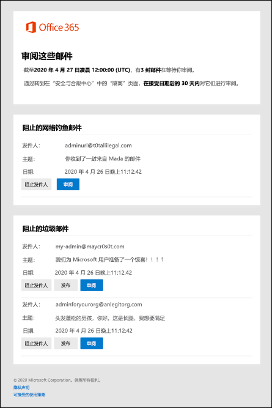

# 使用用户垃圾邮件通知释放并报告隔离邮件Use user spam notifications to release and report quarantined messages

[!INCLUDE [Microsoft 365 Defender rebranding](../includes/microsoft-defender-for-office.md)]

**适用对象****Applies to**
- [Exchange Online ProtectionExchange Online Protection](exchange-online-protection-overview.md)
- [Microsoft Defender for Office 365 计划 1 和计划 2Microsoft Defender for Office 365 plan 1 and plan 2](defender-for-office-365.md)
- [Microsoft 365 DefenderMicrosoft 365 Defender](../defender/microsoft-365-defender.md)

无论是在有 Exchange Online 邮箱的 Microsoft 365 组织中，还是在没有 Exchange Online 邮箱的独立 Exchange Online Protection (EOP) 组织中，隔离功能都会隔离具有潜在危险或不需要的邮件。In Microsoft 365 organizations with mailboxes in Exchange Online or standalone Exchange Online Protection (EOP) organizations without Exchange Online mailboxes, quarantine holds potentially dangerous or unwanted messages. 有关详细信息，请参阅 [EOP 中的隔离邮件](quarantine-email-messages.md)。For more information, see [Quarantined messages in EOP](quarantine-email-messages.md).

默认情况下，最终用户垃圾邮件通知在反垃圾邮件策略中处于禁用状态。By default, end-user spam notifications are disabled in anti-spam policies. 当管理员启用最终用户垃圾邮件通知时，收件人 (包括启用了自动映射的共享邮箱) 将收到自 202) 0 年 4 月开始被隔离为垃圾邮件、批量电子邮件或 (网络钓鱼邮件的定期通知。When an admin [enables end-user spam notifications](configure-your-spam-filter-policies.md#configure-end-user-spam-notifications), recipients (including shared mailboxes with automapping enabled) will receive periodic notifications about their messages that were quarantined as spam, bulk email, or (as of April 2020) phishing.

对于共享邮箱，只有被授予共享邮箱的 FullAccess 权限的用户才支持最终用户垃圾邮件通知。For shared mailboxes, end-user spam notifications are only supported for users who are granted FullAccess permission to the shared mailbox. 有关详细信息，请参阅使用 [EAC 编辑共享邮箱委派](/Exchange/collaboration-exo/shared-mailboxes#use-the-eac-to-edit-shared-mailbox-delegation)。For more information, see [Use the EAC to edit shared mailbox delegation](/Exchange/collaboration-exo/shared-mailboxes#use-the-eac-to-edit-shared-mailbox-delegation).

组不支持最终用户垃圾邮件通知。End User Spam notification is not supported for groups.

> [!NOTE]
> 被隔离为高可信度网络钓鱼、恶意软件或邮件流规则 (也称为传输规则) 仅对管理员可用。Messages that were quarantined as high confidence phishing, malware, or by mail flow rules (also known as transport rules) are only available to admins. 有关详细信息，请参阅[在 EOP 中以管理员身份管理已隔离邮件](manage-quarantined-messages-and-files.md)。For more information, see [Manage quarantined messages and files as an admin in EOP](manage-quarantined-messages-and-files.md).

最终用户垃圾邮件通知包含每个隔离邮件的以下信息：An end-user spam notification contains the following information for each quarantined message:

- **发件人**：已隔离邮件的发送名称和电子邮件地址。**Sender**: The send name and email address of the quarantined message.

- **主题**：隔离邮件的主题行文本。**Subject**: The subject line text of the quarantined message.

- **日期**：隔离邮件 (日期和时间) UTC 格式。**Date**: The date and time (in UTC) that the message was quarantined.

- **阻止发件人**：单击此链接将发件人添加到邮箱上的阻止发件人列表中。**Block Sender**: Click this link to add the sender to the Blocked Senders list on your mailbox. 有关详细信息，请参阅阻止 [邮件发件人](https://support.microsoft.com/office/b29fd867-cac9-40d8-aed1-659e06a706e4)。For more information, see [Block a mail sender](https://support.microsoft.com/office/b29fd867-cac9-40d8-aed1-659e06a706e4).

- **释放**：对于 (网络钓鱼) 邮件，可以在此处释放邮件，而无需进入安全与合规&隔离。**Release**: For spam (not phishing) messages, you can release the message here without going to Quarantine the Security & Compliance Center.

- **Review**： Click this link to go to Quarantine in the Security & Compliance Center， where you can (depending on why the message was quarantined) view， release， delete or report your quarantined messages.**Review**: Click this link to go to Quarantine in the Security & Compliance Center, where you can (depending on why the message was quarantined) view, release, delete or report your quarantined messages. 有关详细信息，请参阅在 [EOP](find-and-release-quarantined-messages-as-a-user.md)中以用户模式查找并释放隔离邮件。For more information, see [Find and release quarantined messages as a user in EOP](find-and-release-quarantined-messages-as-a-user.md).

> [!NOTE]
> 阻止的发件人仍可向您发送邮件。A blocked sender can still send you mail. 来自此发件人的任何发送到您的邮箱的邮件将立即移动到"垃圾邮件"文件夹。Any messages from this sender that make it to your mailbox will be immediately moved to the Junk Email folder. 来自此发件人的未来邮件将转到您的"垃圾邮件"文件夹或最终用户隔离邮箱。Future messages from this sender will go to your Junk Email folder or to the end-user quarantine. 如果要在到达时删除这些邮件，而不是隔离它们，请使用邮件流规则 [ (也称为](/exchange/security-and-compliance/mail-flow-rules/mail-flow-rules) 传输规则) 到达时删除邮件。If you would like to delete these messages on arrival instead of quarantining them, use [mail flow Rules](/exchange/security-and-compliance/mail-flow-rules/mail-flow-rules) (also known as transport rules) to delete the messages on arrival.