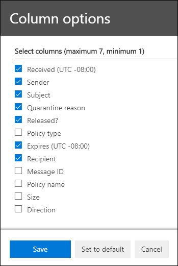

# <a name="view-and-release-quarantined-messages-from-shared-mailboxes"></a><span data-ttu-id="55e57-103">查看并释放共享邮箱中的隔离邮件</span><span class="sxs-lookup"><span data-stu-id="55e57-103">View and release quarantined messages from shared mailboxes</span></span>

> [!NOTE]
> <span data-ttu-id="55e57-104">本文中介绍的功能目前处于预览阶段，不向所有人提供，并且可能会更改。</span><span class="sxs-lookup"><span data-stu-id="55e57-104">The features that are described in this article are currently in Preview, aren't available to everyone, and are subject to change.</span></span>

<span data-ttu-id="55e57-105">用户可以管理隔离邮件，其中他们是收件人之一，如在 EOP 中查找并释放隔离 [邮件中所述](find-and-release-quarantined-messages-as-a-user.md)。</span><span class="sxs-lookup"><span data-stu-id="55e57-105">Users can manage quarantined messages where they are one of the recipients as described in [Find and release quarantined messages as a user in EOP](find-and-release-quarantined-messages-as-a-user.md).</span></span> <span data-ttu-id="55e57-106">但是，用户对邮箱具有"完全访问"和"代理发送"或"代表发送"权限的共享邮箱呢，如 [Exchange Online](https://docs.microsoft.com/exchange/collaboration-exo/shared-mailboxes)中的共享邮箱中所述？</span><span class="sxs-lookup"><span data-stu-id="55e57-106">But what about shared mailboxes where the user has Full Access and Send As or Send on Behalf permissions to the mailbox as described in [Shared mailboxes in Exchange Online](https://docs.microsoft.com/exchange/collaboration-exo/shared-mailboxes)?</span></span>

<span data-ttu-id="55e57-107">以前，用户能够管理发送到共享邮箱的隔离邮件需要管理员为共享邮箱保持启用自动映射 (当管理员授予用户对另一个邮箱邮箱的访问权限时，它默认启用) 。</span><span class="sxs-lookup"><span data-stu-id="55e57-107">Previously, the ability for users to manage quarantined messages sent to a shared mailbox required admins to leave automapping enabled for the shared mailbox (it's enabled by default when an admin gives a user access to another mailbox).</span></span> <span data-ttu-id="55e57-108">但是，根据用户有权访问的邮箱的大小和数量，Outlook 尝试打开用户有权访问的所有邮箱时，性能可能会受到影响。 </span><span class="sxs-lookup"><span data-stu-id="55e57-108">However, depending on the size and number of mailboxes that the user has access to, performance can suffer as Outlooks tries to open *all* mailboxes that the user has access to.</span></span> <span data-ttu-id="55e57-109">因此，许多管理员都选择 [删除共享邮箱的自动映射](https://docs.microsoft.com/outlook/troubleshoot/profiles-and-accounts/remove-automapping-for-shared-mailbox)。</span><span class="sxs-lookup"><span data-stu-id="55e57-109">For this reason, many admins choose to [remove automapping for shared mailboxes](https://docs.microsoft.com/outlook/troubleshoot/profiles-and-accounts/remove-automapping-for-shared-mailbox).</span></span>

<span data-ttu-id="55e57-110">现在，用户不再需要自动映射来管理发送到共享邮箱的隔离邮件。</span><span class="sxs-lookup"><span data-stu-id="55e57-110">Now, automapping is no longer required for users to manage quarantined messages that were sent to shared mailboxes.</span></span> <span data-ttu-id="55e57-111">它只起作用。</span><span class="sxs-lookup"><span data-stu-id="55e57-111">It just works.</span></span> <span data-ttu-id="55e57-112">有两种不同的方法来访问发送到共享邮箱的隔离邮件：</span><span class="sxs-lookup"><span data-stu-id="55e57-112">There are two different methods to access quarantined messages that were sent to a shared mailbox:</span></span>

- <span data-ttu-id="55e57-113">如果管理员已启用反[](configure-your-spam-filter-policies.md)垃圾邮件策略中的最终用户垃圾邮件通知，则有权访问共享邮箱中的最终用户垃圾邮件通知的任何用户都可以单击通知中的"审阅"按钮，转到安全与合规中心中的隔离&。</span><span class="sxs-lookup"><span data-stu-id="55e57-113">If the admin has [enabled end-user spam notifications](configure-your-spam-filter-policies.md) in anti-spam policies, any user that has access to the end-user spam notifications in the shared mailbox can click the **Review** button in the notification to go to quarantine in the Security & Compliance Center.</span></span> <span data-ttu-id="55e57-114">请注意，此方法仅允许用户管理发送到共享邮箱的隔离邮件。</span><span class="sxs-lookup"><span data-stu-id="55e57-114">Note that this method only allows users to manage quarantined messages that were sent to the shared mailbox.</span></span> <span data-ttu-id="55e57-115">用户无法在此上下文中管理自己的隔离邮件。</span><span class="sxs-lookup"><span data-stu-id="55e57-115">Users can't manage their own quarantine messages in this context.</span></span>

- <span data-ttu-id="55e57-116">用户可以[转到安全与合规中心&隔离。](find-and-release-quarantined-messages-as-a-user.md)</span><span class="sxs-lookup"><span data-stu-id="55e57-116">The user can [go to the quarantine in the Security & Compliance Center](find-and-release-quarantined-messages-as-a-user.md).</span></span> <span data-ttu-id="55e57-117">默认情况下，只显示发送给用户的邮件。</span><span class="sxs-lookup"><span data-stu-id="55e57-117">By default, only messages that were sent to the user are shown.</span></span> <span data-ttu-id="55e57-118">但是，用户可以将"邮件 **ID"** 按钮默认 ("排序结果") 更改为收件人电子邮件地址，输入共享邮箱电子邮件地址，然后单击"刷新"以查看发送到共享邮箱的隔离邮件。 </span><span class="sxs-lookup"><span data-stu-id="55e57-118">However, the user can change the **Sort results** (the **Message ID button** by default) to **Recipient email address**, enter the shared mailbox email address, and then click **Refresh** to see the quarantined messages that were sent to the shared mailbox.</span></span>

  

<span data-ttu-id="55e57-120">无论使用哪种方法，用户都可以通过包含隔离邮件的 **"收件人** "列来避免混淆。</span><span class="sxs-lookup"><span data-stu-id="55e57-120">Regardless of the method, users can avoid confusion by including the **Recipient** column for quarantined messages.</span></span> <span data-ttu-id="55e57-121">要显示的最大列数为 7，因此用户需要单击"修改列"，删除现有列 (例如，策略 **类型**) ，选择"收件人"，然后单击"保存"或"保存为 **默认值**"。 </span><span class="sxs-lookup"><span data-stu-id="55e57-121">The maximum number of columns to display is 7, so the user will need to click **Modify columns**, remove an existing column (for example, **Policy type**), select **Recipient**, and then click **Save** or **Save as default**.</span></span>

  

## <a name="things-to-keep-in-mind"></a><span data-ttu-id="55e57-123">要记住的事项</span><span class="sxs-lookup"><span data-stu-id="55e57-123">Things to keep in mind</span></span>

- <span data-ttu-id="55e57-124">第一个对隔离邮件采取行动的用户决定使用共享邮箱的每个人的邮件大小。</span><span class="sxs-lookup"><span data-stu-id="55e57-124">The first user to act on the quarantined message decides the fate of the message for everyone who uses the shared mailbox.</span></span> <span data-ttu-id="55e57-125">例如，如果 10 个用户访问共享邮箱，而用户决定删除隔离邮件，则删除所有 10 个用户的邮件。</span><span class="sxs-lookup"><span data-stu-id="55e57-125">For example, if a shared mailbox is accessed by 10 users, and a user decides to delete the quarantine message, the message is deleted for all 10 users.</span></span> <span data-ttu-id="55e57-126">同样，如果用户决定释放邮件，邮件将释放到共享邮箱，并且共享邮箱的所有其他用户访问。</span><span class="sxs-lookup"><span data-stu-id="55e57-126">Likewise, if a user decides to release the message, it's released to the shared mailbox and is accessible by all other users of the shared mailbox.</span></span>

- <span data-ttu-id="55e57-127">目前 **，"阻止发件人**"按钮在发送到共享邮箱的隔离邮件的"详细信息"飞出中不可用。</span><span class="sxs-lookup"><span data-stu-id="55e57-127">Currently, the **Block sender** button is not available in the **Details** flyout for quarantined messages that were sent to the shared mailbox.</span></span>

- <span data-ttu-id="55e57-128">若要在 [Exchange Online PowerShell](https://docs.microsoft.com/powershell/exchange/connect-to-exchange-online-powershell)中管理共享邮箱的隔离邮件，最终用户需要将 [Get-QuarantineMessage](https://docs.microsoft.com/powershell/module/exchange/get-quarantinemessage) cmdlet 与共享邮箱电子邮件地址一同用于 _RecipientAddress_ 参数的值，以标识这些邮件。</span><span class="sxs-lookup"><span data-stu-id="55e57-128">To manage quarantined messages for the shared mailbox in [Exchange Online PowerShell](https://docs.microsoft.com/powershell/exchange/connect-to-exchange-online-powershell), the end-user will need to use the [Get-QuarantineMessage](https://docs.microsoft.com/powershell/module/exchange/get-quarantinemessage) cmdlet with shared mailbox email address for the value of the _RecipientAddress_ parameter to identify the messages.</span></span> <span data-ttu-id="55e57-129">例如：</span><span class="sxs-lookup"><span data-stu-id="55e57-129">For example:</span></span>

  ```powershell
  Get-QuarantinedMessage -RecipientAddress officeparty@contoso.com
  ```

  <span data-ttu-id="55e57-130">然后，最终用户可以从列表中选择隔离邮件以查看或采取措施。</span><span class="sxs-lookup"><span data-stu-id="55e57-130">Then, the end-user can select a quarantined message from the list to view or take action on.</span></span>

  <span data-ttu-id="55e57-131">本示例显示发送到共享邮箱的所有隔离邮件，然后从隔离邮箱释放列表中的第一封邮件 (列表中的第一封邮件为 0，第二封邮件为 1，) 。</span><span class="sxs-lookup"><span data-stu-id="55e57-131">This example shows all of the quarantined messages that were sent to the shared mailbox, and then releases the first message in the list from quarantine (the first message in the list is 0, the second is 1, and so on).</span></span>

  ```powershell
  $SharedMessages = Get-QuarantinedMessage -RecipientAddress officeparty@contoso.com | select -ExpandProperty Identity
  $SharedMessages
  Release-QuarantinedMessage -Identity $SharedMessages[0]
  ```

  <span data-ttu-id="55e57-132">有关语法和参数的详细信息，请参阅下列主题：</span><span class="sxs-lookup"><span data-stu-id="55e57-132">For detailed syntax and parameter information, see the following topics:</span></span>

  - [<span data-ttu-id="55e57-133">Get-QuarantineMessage</span><span class="sxs-lookup"><span data-stu-id="55e57-133">Get-QuarantineMessage</span></span>](https://docs.microsoft.com/powershell/module/exchange/get-quarantinemessage)
  - [<span data-ttu-id="55e57-134">Get-QuarantineMessageHeader</span><span class="sxs-lookup"><span data-stu-id="55e57-134">Get-QuarantineMessageHeader</span></span>](https://docs.microsoft.com/powershell/module/exchange/get-quarantinemessageheader)
  - [<span data-ttu-id="55e57-135">Preview-QuarantineMessage</span><span class="sxs-lookup"><span data-stu-id="55e57-135">Preview-QuarantineMessage</span></span>](https://docs.microsoft.com/powershell/module/exchange/preview-quarantinemessage)
  - [<span data-ttu-id="55e57-136">Release-QuarantineMessage</span><span class="sxs-lookup"><span data-stu-id="55e57-136">Release-QuarantineMessage</span></span>](https://docs.microsoft.com/powershell/module/exchange/release-quarantinemessage)
