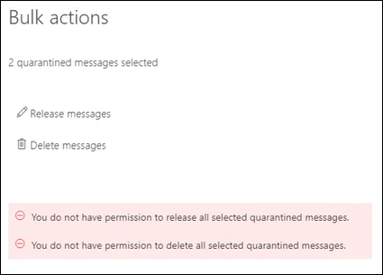

# <a name="view-and-release-quarantined-messages-from-shared-mailboxes"></a>查看并释放共享邮箱中的隔离邮件

> [!NOTE]
> 本文中所述的功能目前处于预览阶段，不可用于所有人，并且可能会发生更改。

如果隔离邮件是以 [EOP 中的用户的方式查找和释放隔离邮件](find-and-release-quarantined-messages-as-a-user.md)中所述的收件人之一，则用户可以对这些邮件进行管理。 但是，如果用户具有对邮箱的完全访问权限和 "代理发送" 或 "代表发送" 权限的共享邮箱，如 [Exchange Online 中的共享邮箱](https://docs.microsoft.com/exchange/collaboration-exo/shared-mailboxes)中所述，则该怎么办？

以前，用户可以管理发送到共享邮箱的隔离邮件。若要使自动映射为共享 (邮箱启用了邮箱，默认情况下，当管理员授予用户对另一个邮箱) 的访问权限时，默认情况下会启用该功能。 但是，根据用户有权访问的邮箱的大小和数量，在 Outlooks 尝试打开用户有权访问的 *所有* 邮箱时，性能可能会受到影响。 因此，许多管理员选择 [删除共享邮箱的自动映射](https://docs.microsoft.com/outlook/troubleshoot/profiles-and-accounts/remove-automapping-for-shared-mailbox)。

现在，用户不再需要自动映射来管理发送到共享邮箱的隔离邮件。 它仅适用于工作。 有两种不同的方法可用于访问发送到共享邮箱的隔离邮件：

- 如果管理员已在反垃圾邮件策略中 [启用了最终用户垃圾邮件通知](https://docs.microsoft.com/microsoft-365/security/office-365-security/configure-your-spam-filter-policies) ，则有权访问共享邮箱中的最终用户垃圾邮件通知的任何用户都可以单击通知中的 " **审阅** " 按钮，以转到安全 & 合规性中心中的 "隔离"。 请注意，此方法仅允许用户管理发送到共享邮箱的隔离邮件。 用户无法在此上下文中管理自己的隔离邮件。

- 用户可以 [转到 Security & 合规性中心中的隔离](find-and-release-quarantined-messages-as-a-user.md)。 默认情况下，仅显示发送给用户的邮件。 但是，用户可以更改 **邮件 ID 按钮** (的 **排序结果**，默认情况下) "**收件人电子邮件地址**"，输入共享邮箱电子邮件地址，然后单击 "**刷新**" 以查看发送到共享邮箱的隔离邮件。

  

无论采用哪种方法，用户都可以通过包含隔离邮件的 **收件人** 列来避免混淆。 要显示的最大列数为7，因此用户需要单击 " **修改列**"，删除现有列 (例如，" **策略类型** " ") "，选择 " **收件人**"，然后单击 " **保存** " 或 " **另存为默认值**"。

  

## <a name="things-to-keep-in-mind"></a>要记住的事项

- 对隔离邮件进行操作的第一个用户为使用共享邮箱的每个人决定邮件的 fate。 例如，如果有10个用户访问共享邮箱，并且用户决定删除隔离邮件，则会删除所有10个用户的邮件。 同样，如果用户决定释放邮件，则会将其发布到共享邮箱，并可供共享邮箱的所有其他用户访问。

- 目前，如果用户选择发送到共享邮箱的多个隔离邮件，则当用户单击 "**释放邮件**" 或 "删除 **批量操作**" 浮出控件中的 **邮件** 时，将返回以下误导性错误：

  > 您没有权限释放所有选定的隔离邮件。
  >
  > 您没有删除所有选定的隔离邮件的权限。

  无论错误是什么，都会对邮件执行操作，并且可以忽略该错误。

  

- 目前，" **阻止发件人** " 按钮在已发送到共享邮箱的隔离邮件的 " **详细信息** " 浮出控件中不可用。

- 若要在 [Exchange Online PowerShell](https://docs.microsoft.com/powershell/exchange/connect-to-exchange-online-powershell)中管理共享邮箱的隔离邮件，最终用户需要将 [get-quarantinemessage](https://docs.microsoft.com/powershell/module/exchange/get-quarantinemessage) cmdlet 与共享邮箱电子邮件地址结合使用，以确定邮件的 _RecipientAddress_ 参数值。 例如：

  ```powershell
  Get-QuarantinedMessage -RecipientAddress officeparty@contoso.com
  ```

  然后，最终用户可以从列表中选择隔离的邮件以进行查看或对其执行操作。

  本示例显示发送到共享邮箱的所有隔离邮件，然后从隔离区中释放列表中的第一封邮件， (列表中的第一条消息为0，第二个是1，依此类推) 。

  ```powershell
  $SharedMessages = Get-QuarantinedMessage -RecipientAddress officeparty@contoso.com | select -ExpandProperty Identity
  $SharedMessages
  Release-QuarantinedMessage -Identity $SharedMessages[0]
  ```

  有关语法和参数的详细信息，请参阅下列主题：

  - [Get-quarantinemessage](https://docs.microsoft.com/powershell/module/exchange/get-quarantinemessage)
  - [QuarantineMessageHeader](https://docs.microsoft.com/powershell/module/exchange/get-quarantinemessageheader)
  - [预览-Get-quarantinemessage](https://docs.microsoft.com/powershell/module/exchange/preview-quarantinemessage)
  - [发布-Get-quarantinemessage](https://docs.microsoft.com/powershell/module/exchange/release-quarantinemessage)
