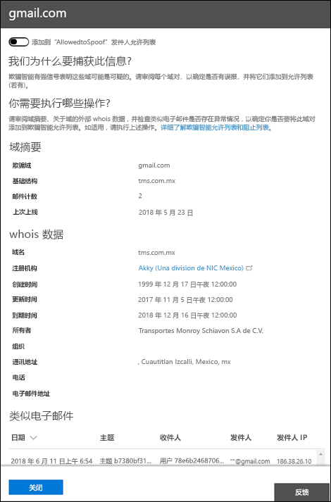

# 演练-Microsoft Defender for Office 365 中的欺骗智能洞察力

[!INCLUDE [Microsoft 365 Defender rebranding](../includes/microsoft-defender-for-office.md)]

在使用拥有 Defender for Office 365 的 Microsoft 365 组织中，您可以使用欺骗智能洞察力快速确定哪些发件人合法向您发送未经身份验证的电子邮件 (来自不通过 SPF、DKIM 或 DMARC 检查的域的邮件) 。

通过允许已知发件人从已知位置发送欺骗邮件，可以减少误报 (被标记为坏) 的良好电子邮件。 通过监视允许的欺骗性发件人，您可以提供额外的安全层来防止不安全的邮件到达您的组织中。

有关报告和见解的详细信息，请参阅 [Security & 合规性中心中的报告和见解](reports-and-insights-in-security-and-compliance.md)。

本演练是安全 & 合规中心的几个演练之一。 若要导航报告和见解，请参阅 [相关主题](#related-topics) 部分中的演练。

## 开始前，有必要了解什么？

- 安全与合规中心的打开网址为 <https://protection.office.com/>。 若要直接转到 **安全仪表板** 页面，请使用 <https://protection.office.com/searchandinvestigation/dashboard> 。

  您可以从安全 & 合规中心的多个仪表板中查看欺骗性智能洞察力。 无论您正在查看哪个仪表板，真知灼见都会提供相同的详细信息，并允许您快速执行相同的任务。

- 您需要在安全 & 合规性中心中分配权限，然后才能执行本文中的过程：
  - **组织管理**
  - **安全管理员**
  - **安全读者**
  - **全局读者**

  **注意**：将用户添加到 microsoft 365 管理中心中对应的 Azure Active Directory 角色，用户可为用户提供安全 & 合规性中心中的必需权限 _以及_ Microsoft 365 中其他功能的权限。 有关详细信息，请参阅[关于管理员角色](https://docs.microsoft.com/microsoft-365/admin/add-users/about-admin-roles)。

- 在 Microsoft Defender for Office 365 中启用和禁用欺骗智能在反网络钓鱼策略中。 有关详细信息，请参阅 [在 Microsoft Defender For Office 365 中配置反网络钓鱼策略](configure-atp-anti-phishing-policies.md)。

- 若要使用欺骗智能来监视和管理向您发送未经身份验证的邮件的发件人，请参阅 [在 Microsoft 365 中配置欺骗智能](learn-about-spoof-intelligence.md)。

## 在安全 & 合规中心中打开欺骗性智能洞察力

1. 在安全 & 合规性中心中，转到 " **威胁管理** \> **仪表板"。**

2. 在 " **见解** " 行中，查找以下项目之一：

   - **启用欺骗智能**：该洞察力被命名为 **欺骗性域，在过去30天的身份验证失败**。 这是默认选项。
   - **已禁用欺骗情报**：已命名 **启用欺骗保护** 的洞察力，单击它可启用欺骗智能。

3. 仪表板上的洞察力显示如下所示的信息：

   

   此洞察力有两种模式：

   - **真知灼见模式**：如果启用欺骗智能，则真知灼见将显示在过去30天内受到欺骗智能功能影响的邮件数。

   - **如果模式** 为：如果禁用欺骗情报，则真知灼见将显示在过去30天中，我们的欺骗智能功能 *会* 影响多少封邮件。

   无论哪种方式，真知灼见中显示的欺骗性域都分为两类： **可疑域对** 和 **非可疑域对**。 这些类别进一步细分为三个不同的存储桶供您查看。

   **域对** 是 "发件人" 地址和发送基础结构的组合：

   - 发件人地址是在电子邮件客户端的发件人框中显示的发件人的电子邮件地址。 此地址也称为 `5322.From` 地址。

   - 发送方结构或发件人是发送 IP 地址的反向 DNS 查找 (PTR 记录) 的组织域。 如果发送 IP 地址没有 PTR 记录，则发件人由使用 CIDR 表示法中的255.255.255.0 子网掩码的发送 IP 标识 (/24) 。 例如，如果 IP 地址为192.168.100.100，则发件人的完整 IP 地址为 192.168.100.100/24。

   **可疑域对** 包括：

   - **高可信度欺骗**：基于域的历史发送模式和信誉得分，我们非常确信域是哄骗的，并且来自这些域的邮件更有可能是恶意的。

   - **中等可信度欺骗**：根据历史发送模式和域的信誉得分，我们确保了域是欺骗的，并且从这些域发送的邮件是合法的。 在此类别中，误报的可能性更大，而不是高度信心欺骗。

   - **非可疑域对** (包括 **rescued 欺骗**) ：域失败显式电子邮件身份验证检查 [SPF](how-office-365-uses-spf-to-prevent-spoofing.md)、 [DKIM](use-dkim-to-validate-outbound-email.md)和 [DMARC](use-dmarc-to-validate-email.md)) 。 但是，域通过隐式电子邮件身份验证检查 ([复合身份验证](email-validation-and-authentication.md#composite-authentication)) 。 因此，不会对邮件执行任何反欺骗操作。

### 查看有关欺骗性智能洞察力的可疑域对的详细信息

1. 在 "欺骗智能洞察力" 中，单击 "高"、"中等" 或 "rescued") 中的任一域对 (。

   将显示 " **欺骗性智能洞察力** " 页。 页面向您显示将未经身份验证的电子邮件发送到您的组织的发件人列表。

   此信息可帮助您确定是否授权欺骗邮件，或者是否需要执行进一步的操作。

   您可以按邮件数、欺骗的上次检测日期等对信息进行排序。

2. 在表中选择一个项目，打开包含有关域对的丰富信息的详细信息窗格。 这些信息包括：
   - 为什么我们会发现这一点。
   - 您需要执行的操作。
   - 域摘要。
   - WhoIs 有关发件人的数据。
   - 从同一个发件人在你的租户中看到的类似消息。

   在这里，您还可以选择在 **AllowedToSpoof** 安全发件人列表中添加或删除域对。

   

### 在 AllowedToSpoof 列表中添加或删除域

您可以在域对的欺骗性智能洞察力的详细信息窗格中的 "AllowedToSpoof (安全发件人) 列表中添加或删除域。 只需设置相应的开关即可。

仅允许域对允许欺骗域 *和* 发送基础结构的组合。 它不允许来自任何来源的来自欺骗域的电子邮件，也不允许来自任何域的发送基础结构的电子邮件。

例如，您允许以下域对将欺骗邮件发送到您的组织：

- *冒牌域*： gmail.com "
- *发送基础结构* `tms.mx.com` ：

仅允许来自此域对的电子邮件欺骗。 不允许其他试图欺骗 gmail.com 的发件人。 来自 tms.mx.com 的其他域中的邮件由欺骗情报检查。

## 相关主题

[Microsoft 365 中的反欺骗保护](anti-spoofing-protection.md)
