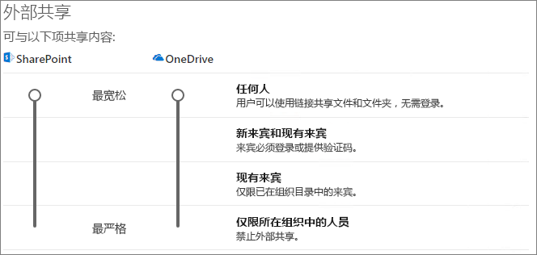

# 在网站中与来宾协作

如果需要在文档、数据和列表之间与来宾进行协作，则可以使用 SharePoint 网站。 新式 SharePoint 网站连接到 Microsoft 365 组，并且可以管理网站成员身份并提供其他协作工具（如共享邮箱和日历）。

在本文中，我们将逐步完成为与来宾协作设置 SharePoint 网站所必需的 Microsoft 365 配置步骤。

## 视频演示

该视频显示了本文档中描述的配置步骤。 

> [!VIDEO https://www.microsoft.com/videoplayer/embed/RE44Llg?autoplay=false]

## Azure 外部协作设置

Microsoft 365 中的共享受 [Azure Active Directory 中的组织关系设置](https://docs.microsoft.com/azure/active-directory/external-identities/delegate-invitations)的最高级别的管辖。 如果在 Azure AD 中禁用或限制来宾共享，此设置将覆盖您在 Microsoft 365 中配置的任何共享设置。

检查外部协作设置以确保不会阻止与来宾共享。

设置外部协作设置

1. 在上登录到 Azure Active Directory [https://aad.portal.azure.com](https://aad.portal.azure.com) 。
2. 在左侧导航窗格中，单击 " **Azure Active Directory**"。
3. 单击 " **外部标识**"。
4. 在 " **开始** " 屏幕的左侧导航窗格中，单击 " **外部协作设置**"。
5. 确保 **来宾邀请者角色中的管理员和用户可以邀请** 和 **成员** 都可以邀请都设置为 **"是"**。
6. 如果进行了任何更改，请单击 **“保存”**。

请注意 " **协作限制** " 部分中的设置。 确保不会阻止您要与之进行协作的来宾域。

如果您使用多个组织的来宾，您可能希望限制其访问目录数据的能力。 这将阻止他们看到目录中的其他人是来宾。 若要执行此操作，请在 " **来宾用户访问限制**" 下，选择 " **来宾用户对属性和目录对象的成员身份的访问权限受到限制** "，并且 **来宾用户访问仅限于其自己的目录对象的属性和成员身份**。

## Microsoft 365 组来宾设置

新式 SharePoint 网站使用 Microsoft 365 组来控制网站访问。 必须打开 Microsoft 365 组来宾设置，才能使 SharePoint 网站中的来宾访问能够正常工作。

设置 Microsoft 365 组来宾设置

1. 在 Microsoft 365 管理中心的左侧导航窗格中，展开 " **设置**"。
2. 单击 " **组织设置**"。
3. 在列表中，单击 " **Microsoft 365 组**"。
4. 确保选中 " **允许组所有者将组织外部的人员添加为 Microsoft 365 组** " 和 " **允许来宾组成员访问组内容** " 复选框。
5. 如果进行了更改，请单击 " **保存更改**"。

## SharePoint 组织级别的共享设置

为使来宾能够访问 SharePoint 网站，SharePoint 组织级别的共享设置必须允许与来宾共享。

组织级别设置确定将对单个网站可用的设置。 网站设置不能比组织级别设置更具有更好的许可。

如果要允许未经身份验证的文件和文件夹共享，请选择 " **任何人**"。 如果要确保组织外部的所有人员都必须进行身份验证，请选择 " **新建" 和 "现有来宾**"。 选择组织中的任何网站将需要的 "最高" 设置。

设置 SharePoint 组织级别的共享设置

1. 在 Microsoft 365 管理中心的左侧导航窗格中，单击 " **管理中心**" 下的 " **SharePoint**"。
2. 在 SharePoint 管理中心中，在左侧导航窗格中的 " **策略**" 下，单击 " **共享**"。
3. 确保将 SharePoint 的 "外部共享" 设置为 " **任何人** " 或 " **新的和现有的来宾**"。
4. 如果进行了任何更改，请单击 **“保存”**。

## 创建网站

下一步是创建您计划用于与来宾协作的网站。

创建网站
1. 在 SharePoint 管理中心中的“**网站**”下，单击“**活动站点**”。
2. 单击“**创建**”。
3. 单击 " **团队网站**"。
4. 键入网站名称，并为组所有者 (网站所有者) 输入名称。
5. 在 " **高级设置**" 下，选择要将此网站设为公共网站还是专用网站。
6. 单击"下一步"。
7. 单击“完成”****。

我们将稍后邀请用户。 接下来，请务必检查此网站的网站级共享设置。

## SharePoint 网站级别的共享设置

检查网站级别的共享设置以确保它们允许您对此网站所需的访问类型。 例如，如果将组织级别设置设置为 " **任何人**"，但希望所有来宾都对此网站进行身份验证，请确保将网站级别的共享设置设置为 " **新建" 和 "现有来宾**"。

请注意，不能将网站与未经身份验证的人员共享 (**任何人** 设置) ，但可以使用各个文件和文件夹。

设置网站级共享设置
1. 在 SharePoint 管理中心的左侧导航栏中，展开 **“站点”**，然后单击 **“活动站点”**。
2. 选择要共享的网站。
3. 单击 "..."，然后单击 " **共享**"。
4. 确保将 "共享" 设置为 " **任何人** " 或 " **新的和现有的来宾**"。
5. 如果进行了任何更改，请单击 **“保存”**。

## 邀请用户

现在已配置来宾共享设置，因此您可以开始向网站添加内部用户和来宾。 网站访问通过关联的 Microsoft 365 组进行控制，因此我们将在此处添加用户。

向组邀请内部用户
1. 导航到要在其中添加用户的网站。
2. 单击右上角表示成员计数的 " **成员** " 链接。
3. 单击“**添加成员**”。
4. 键入要邀请到网站的用户的名称或电子邮件地址，然后单击 " **保存**"。

无法从网站添加来宾用户。 您需要在 web 上使用 Outlook 添加它们。 因此，作为向组添加和邀请来宾的先决条件，可在 " **URL**  " 列中单击网站的 url 以导航到特定于站点的页面。 在此页面中，单击 **应用启动器** 图标，然后选择 " **Outlook**"。 在此屏幕中，可以将来宾邀请到组中，具体步骤如下所述。

将来宾邀请到组
1. 在 " **组**" 下，单击要邀请其来宾的组。
2. 打开 "组联系人卡片"，单击右上方的 " **成员** " 链接 (表示成员计数) 的链接。
3. 单击 " **添加成员**"。
4. 键入要邀请的来宾的电子邮件地址，然后单击 " **添加**"。
5. 单击“关闭”****。
请注意，仅当您不是组的所有者时，才需要单击 " **关闭** "，因此，不允许将来宾添加到组中。 在这种情况下，将来宾添加到组中的请求将转移到组所有者以供审批。

## 另请参阅

[有关与未经认证用户共享文件和文件夹的最佳做法](best-practices-anonymous-sharing.md)

[与来宾共享时限制文件意外曝光](share-limit-accidental-exposure.md)

[创建安全的来宾共享环境](create-secure-guest-sharing-environment.md)

[创建托管有来宾的 B2B 外联网](b2b-extranet.md)

[与 Azure AD B2B 的 SharePoint 和 OneDrive 集成](https://docs.microsoft.com/sharepoint/sharepoint-azureb2b-integration-preview)
