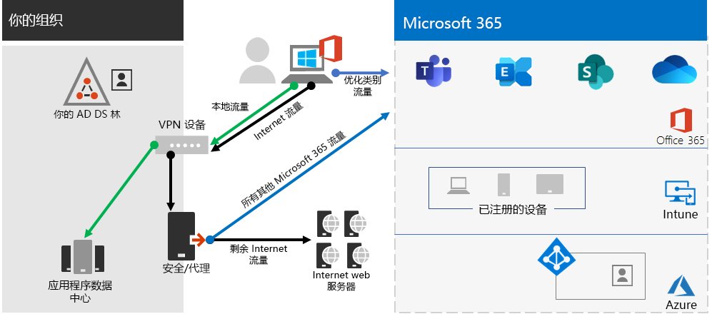
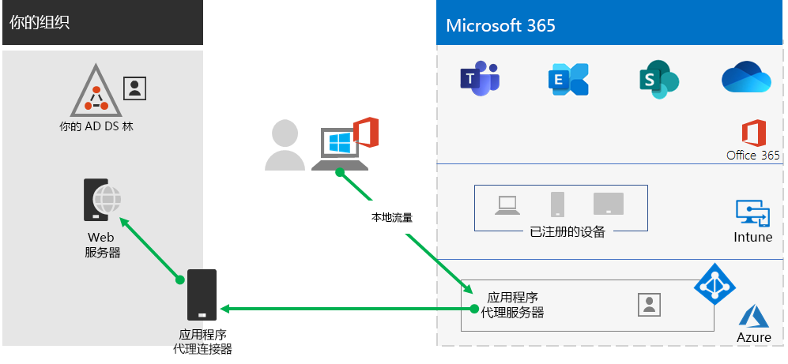
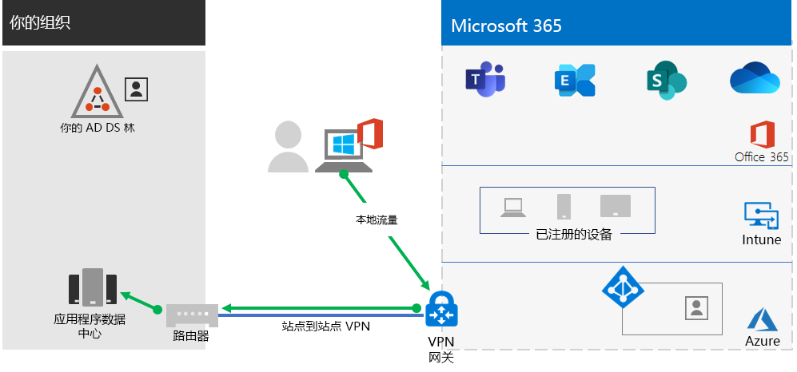

# 步骤 2.Step 2. 提供对本地应用和服务的远程访问权限。Provide remote access to on-premises apps and services

如果你的组织使用远程访问 VPN 解决方案（通常通过网络边缘上的 VPN 服务器以及在用户的设备上安装的 VPN 客户端），你的用户可以使用远程访问 VPN 连接来访问本地应用和服务器。If your organization uses a remote access VPN solution, typically with VPN servers on the edge of your network and VPN clients installed on your users' devices, your users can use remote access VPN connections to access on-premises apps and servers. 但是，你可能需要优化与 Microsoft 365 基于云的服务的通信。But you may need to optimize traffic to Microsoft 365 cloud-based services.

如果你的用户未使用 VPN 解决方案，你可以使用 Azure Active Directory (Azure AD) 应用程序代理和 Azure 点到站点 (P2S) VPN 来提供访问权限，具体取决于你的所有应用是否均基于 Web。If your users do not use a VPN solution, you can use Azure Active Directory (Azure AD) Application Proxy and Azure Point-to-Site (P2S) VPN to provide access, depending on whether all your apps are web-based.

有三种主要配置：There are three primary configurations:

1. 你已在使用远程访问 VPN 解决方案。You are already using a remote access VPN solution.
2. 你使用的不是远程访问 VPN 解决方案，你有混合标识，只需远程访问基于 Web 的本地应用。You are not using a remote access VPN solution, you have hybrid identity, and you need remote access only to on-premises web-based apps.
3. 你使用的不是远程访问 VPN 解决方案，并且你需要访问本地应用，其中一些应用并非基于 Web。You are not using a remote access VPN solution and you need access to on-premises apps, some of which are not web-based.

借助远程访问连接，还可以使用[远程桌面](https://support.microsoft.com/help/4028379/windows-10-how-to-use-remote-desktop)将用户连接到本地电脑。With remote access connections, you can also use [Remote Desktop](https://support.microsoft.com/help/4028379/windows-10-how-to-use-remote-desktop) to connect your users to an on-premises PC. 例如，远程工作者可使用远程桌面从其 Windows、iOS 或 Android 设备连接到其办公室的电脑。For example, a remote worker can use Remote Desktop to connect to the PC in their office from their Windows, iOS or Android device. 远程连接后，他们可以像坐在电脑前一样使用它。Once they are remotely connected, they can use it as if they were sitting in front of it.

## 优化 Microsoft 365 云服务远程访问 VPN 客户端的性能Optimize performance for remote access VPN clients to Microsoft 365 cloud services

如果远程工作者正在使用传统的 VPN 客户端来获取对组织网络的远程访问权限，请验证该 VPN 客户端是否支持拆分隧道。If your remote workers are using a traditional VPN client to obtain remote access to your organization network, verify that the VPN client has split tunneling support.

如果没有拆分隧道，所有远程工作通信都将通过 VPN 连接发送。在这种情况下，必须将其转发到组织的边缘设备、进行处理，然后在 Internet 上发送。Without split tunneling, all of your remote work traffic gets sent across the VPN connection, where it must be forwarded to your organization’s edge devices, get processed, and then sent on the Internet.

Microsoft 365 通信必须通过你的组织获取间接路由，它可能是面向远离 VPN 客户端物理位置的 Microsoft 网络入口点的转发。Microsoft 365 traffic must take an indirect route through your organization, which could be the forwarded to a Microsoft network entry point far away from the VPN client’s physical location. 此间接路径会增加网络流量的延迟并降低整体性能。This indirect path adds latency to the network traffic and decreases overall performance. 

借助拆分隧道，你可以将 VPN 客户端配置为排除通过 VPN 连接发送到组织网络的特定类型的通信。With split tunneling, you can configure your VPN client to exclude specific types of traffic from being sent over the VPN connection to the organization network.

要优化 Microsoft 365 云资源的访问权限，请将拆分隧道 VPN 客户端配置为排除通过 VPN 连接的流向**优化**类别 Microsoft 365 终结点的流量。To optimize access to Microsoft 365 cloud resources, configure your split tunneling VPN clients to exclude traffic to the **Optimize** category Microsoft 365 endpoints over the VPN connection. 有关详细信息，请参阅 [Office 365 终结点类别](https://docs.microsoft.com/office365/enterprise/office-365-network-connectivity-principles#new-office-365-endpoint-categories)。For more information, see [Office 365 endpoint categories](https://docs.microsoft.com/office365/enterprise/office-365-network-connectivity-principles#new-office-365-endpoint-categories). 请在[此处](https://docs.microsoft.com/office365/enterprise/urls-and-ip-address-ranges)查看优化类别终结点的列表。See the list of Optimize category endpoints [here](https://docs.microsoft.com/office365/enterprise/urls-and-ip-address-ranges).

这允许 VPN 客户端直接通过 Internet 发送和接收重要的 Microsoft 365 云服务流量并发送到 Microsoft 网络最近的入口点。This allows the VPN client to send and receive crucial Microsoft 365 cloud service traffic directly over the Internet and to the nearest entry point into the Microsoft network.

有关更多信息和指导，请参阅[使用 VPN 拆分隧道为远程用户优化 Office 365 连接](https://docs.microsoft.com/office365/enterprise/office-365-vpn-split-tunnel)。For more information and guidance, see [Optimize Office 365 connectivity for remote users using VPN split tunneling](https://docs.microsoft.com/office365/enterprise/office-365-vpn-split-tunnel).

## 在所有应用均为 Web 应用且你具有混合标识的情况下部署远程访问Deploy remote access when all your apps are web apps and you have hybrid identity

如果远程工作者使用的不是传统的 VPN 客户端，并且你的本地用户帐户和组与 Azure AD 同步，则可以使用 Azure AD 应用程序代理为 Intranet 服务器上托管的基于 Web 的应用程序实现安全的远程访问。If your remote workers are not using a traditional VPN client and your on-premises user accounts and groups are synchronized with Azure AD, you can use Azure AD Application Proxy to provide secure remote access for web-based applications hosted on intranet servers. 基于 Web 的应用程序包括 SharePoint 网站、Outlook Web Access 服务器或任何其他基于 Web 的业务线应用程序。Web-based applications include SharePoint sites, Outlook Web Access servers, or any other web-based line of business applications. 

下面是 Azure AD 应用程序代理的组件。Here are the components of Azure AD Application Proxy.

有关详细信息，请参阅此 [Azure AD 应用程序代理概述](https://docs.microsoft.com/azure/active-directory/manage-apps/application-proxy)。For more information, see this [overview of Azure AD Application Proxy](https://docs.microsoft.com/azure/active-directory/manage-apps/application-proxy).

## 在并非所有应用均为 Web 应用的情况下部署远程访问Deploy remote access when not all your apps are web apps

如果远程工作者使用的不是传统的 VPN 客户端，并且你的任何应用不是基于 Web，则可以使用 Azure 点到站点 (P2S) VPN。If your remote workers are not using a traditional VPN client and any of your apps are not web-based, you can use an Azure Point-to-Site (P2S) VPN.

P2S VPN 连接通过 Azure 虚拟网络创建从远程工作者的设备到组织网络的安全连接。A P2S VPN connection creates a secure connection from a remote worker’s device to your organization network through an Azure virtual network. 

有关详细信息，请参阅此 [P2S VPN 概述](https://docs.microsoft.com/azure/vpn-gateway/point-to-site-about)。For more information, see this [overview of P2S VPN](https://docs.microsoft.com/azure/vpn-gateway/point-to-site-about).

## 部署 Windows 虚拟桌面，以便为使用个人设备的远程工作者提供远程访问权限Deploy Windows Virtual Desktop to provide remote access for remote workers using personal devices 

要为仅可使用自己的个人和非托管设备的远程工作者提供支持，请使用 Azure 中的 Windows 虚拟桌面创建并分配虚拟桌面，以便用户在家中使用。To support remote workers who can only use their personal and unmanaged devices, use Windows Virtual Desktop in Azure to create and allocate virtual desktops for your users to use from home.

虚拟电脑可以像连接到组织网络的电脑一样操作。Virtualized PCs can act just like PCs connected to your organization network.

有关详细信息，请参阅此 [Windows 虚拟桌面概述](https://docs.microsoft.com/azure/virtual-desktop/overview)。For more information, see [this overview of Windows Virtual Desktop](https://docs.microsoft.com/azure/virtual-desktop/overview).

## 用于远程访问的管理员技术资源Admin technical resources for remote access

- [如何快速优化远程办公人员的 Office 365 流量并降低你的基础结构上的负载How to quickly optimize Office 365 traffic for remote staff & reduce the load on your infrastructure](https://techcommunity.microsoft.com/t5/office-365-blog/how-to-quickly-optimize-office-365-traffic-for-remote-staff-amp/ba-p/1214571)
- [使用 VPN 拆分隧道为远程用户优化 Office 365 连接Optimize Office 365 connectivity for remote users using VPN split tunneling](https://docs.microsoft.com/office365/enterprise/office-365-vpn-split-tunnel)

## 步骤 2 的结果Results of Step 2

为远程工作者部署远程访问解决方案后：After deployment of a remote access solution for your remote workers:

| 远程访问配置Remote access configuration | 结果Results |
|:-------|:-----|
| 远程访问 VPN 解决方案已到位A remote access VPN solution is in place | 已经针对拆分隧道和 Microsoft 365 终结点的“优化”类别配置远程访问 VPN 客户端。You have configured your remote access VPN client for split tunneling and for the Optimize category of Microsoft 365 endpoints. |
| 没有远程访问 VPN 解决方案，并且只需远程访问基于 Web 的本地应用No remote access VPN solution and you need remote access only to on-premises web-based apps | 已配置 Azure 应用程序代理。You have configured Azure Application Proxy. |
| 没有远程访问 VPN 解决方案，并且需要访问本地应用，其中一些应用并非基于 WebNo remote access VPN solution and you need access to on-premises apps, some of which are not web-based | 已配置 Azure P2S VPN。You have configured Azure P2S VPN. |
| 远程工作人员正在家中使用自己的个人设备Remote workers are using their personal devices from home | 已配置 Windows 虚拟桌面。You have configured Windows Virtual Desktop. |
|||

## 后续步骤Next step

继续执行[步骤 3](empower-people-to-work-remotely-manage-endpoints.md)，以管理你的设备、电脑和其他终结点。Continue with [Step 3](empower-people-to-work-remotely-manage-endpoints.md) to manage your devices, PCs, and other endpoints.
