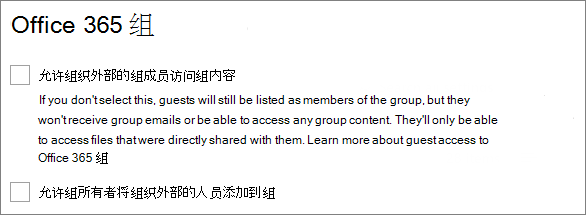
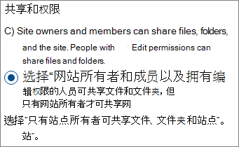
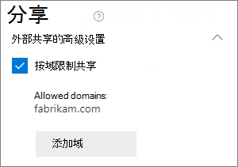
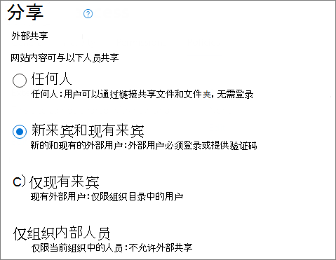

# 限制 Microsoft 365 中的共享Limit sharing in Microsoft 365

虽然无法完全禁用内部共享，也无法删除网站中的“共享”按钮，但可通过多种方式来限制 Microsoft 365 中的共享，以满足组织的需求。While you can't disable internal sharing entirely or remove the Share button from sites, there are a variety of ways that you can limit sharing in Microsoft 365 to meet the needs of your organization.

下表列出了共享文件的方法。The methods of sharing files are listed in the table below. 有关详细信息，请单击“**共享方法**”列中的链接。Click the link in the **Sharing method** column for detailed information.

|共享方法Sharing method|说明Description|限制选项Limiting options|
|:-------------|:----------|:-------------|
|[Office 365 组或团队Office 365 group or team](#office-365-group-or-team)|被授予加入 Microsoft Teams 团队或 Office 365 组的权限的用户可以编辑关联的 SharePoint 网站中的文件。People granted access to a Microsoft Teams team or Office 365 group have edit access to files in the associated SharePoint site.|如果组或团队是专用的，则用于加入团队的共享邀请将会转到所有者那里以供其审批。If the group or team is private, sharing invitations to join the team go to the owner for approval. 管理员可通过禁用来宾访问来阻止组织外部人员的访问。Admins can disable guest access to prevent access by people from outside the organization.|
|[SharePoint 网站SharePoint site](#sharepoint-site)|可向用户授予对 SharePoint 网站的“所有者”、“成员”或“访问者”访问权限，他们将拥有对网站中文件的相应访问权限级别。People can be granted Owner, Member, or Visitor access to a SharePoint site and will have that level of access to files in the site.|可限制网站权限，以便只有网站所有者可以共享网站。Site permissions can be restricted so that only site owners can share the site.|
|[与特定人员共享Sharing with specific people](#sharing-with-specific-people)|网站成员和拥有编辑权限的人员可以提供对文件和文件夹的直接权限，或通过使用*特定人员*链接进行共享。Site members and people with edit permissions can give direct permissions to files and folders or share them by using *Specific people* links.|可限制网站权限，以便只有网站所有者可以共享文件和文件夹。Site permissions can be restricted so that only site owners can share files and folders. 在这种情况下，网站成员提供的直接访问和*特定人员*链接共享将会转到网站所有者那里以供其审批。In this case, direct access and *Specific people* link sharing by site members goes to site owner for approval.|
|[SharePoint 来宾共享SharePoint guest sharing](#sharepoint-guest-sharing)|SharePoint 网站所有者和成员可与组织外部的人员共享文件和文件夹。SharePoint site owners and members can share files and folders with people outside the organization.|可针对整个组织或单个网站禁用来宾共享。Guest sharing can be disabled for the entire organization or for individual sites.|
|[*你组织中的人员*共享链接*People in your organization* sharing links](#people-in-your-organization-sharing-links)|SharePoint 网站所有者和成员可以使用*你组织中的人员*链接（可用于组织内的所有人）来共享文件。SharePoint site owners and members can share files using *People in your organization* links, which will work for anyone inside the organization.|可在网站级别禁用*你组织中的人员*链接。*People in your organization* links can be disabled at the site level.|
|[电子邮件Email](#email)|有权访问文件的人员可通过电子邮件将其发送给其他人。People with access to a file can send it to others via email.|管理员可以使用敏感度标签对文件进行加密，以防止有人与未经授权的人员共享这些文件。Admins can encrypt files by using sensitivity labels to prevent them being shared with unauthorized people.|
|[下载或文件复制Download or file copy](#download-or-file-copy)|有权访问文件的人员可以下载或复制该文件，并与 Microsoft 365 范围之外的其他人共享。People with access to a file can download or copy it and share it with others outside the scope of Microsoft 365.|管理员可以使用敏感度标签对文件进行加密，以防止有人与未经授权的人员共享这些文件。Admins can encrypt files by using sensitivity labels to prevent them being shared with unauthorized people.|

虽然可使用本文中介绍的管理员控制措施来限制组织内的共享，但我们强烈建议考虑使用 Microsoft 365 中提供的安全和合规性功能，以创建安全的共享环境。While you can use the admin controls described in this article to limit sharing in your organization, we highly recommend that you consider using the security and compliance features available in Microsoft 365 to create a secure sharing environment. 有关信息，请参阅[使用 Microsoft 365 在 SharePoint 中进行文件协作](https://docs.microsoft.com/sharepoint/deploy-file-collaboration)和[用于高度管控数据的 Teams](https://docs.microsoft.com/microsoft-365/enterprise/secure-teams-highly-regulated-data-scenario)。See [File collaboration in SharePoint with Microsoft 365](https://docs.microsoft.com/sharepoint/deploy-file-collaboration) and [Teams for highly regulated data](https://docs.microsoft.com/microsoft-365/enterprise/secure-teams-highly-regulated-data-scenario) for information.

若要了解组织中如何使用共享，请[运行文件和文件夹共享报告](https://docs.microsoft.com/sharepoint/sharing-reports)。To understand how sharing is being used in your organization, [run a report on file and folder sharing](https://docs.microsoft.com/sharepoint/sharing-reports).

## Office 365 组或团队Office 365 group or team

如果想要限制 Office 365 组或 Microsoft Teams 团队中的共享，请务必将组或团队设为专用。If you want to limit sharing in an Office 365 group or Microsoft Teams team, it's important to make the group or team private. 组织内部人员可以随时加入公共组或团队。People inside your organization can join a public group or team anytime. 除非组或团队是专用的，否则无法在组织内限制团队或其文件的共享。Unless the group or team is private, there's no way to limit sharing of the team or its files within the organization.

### 来宾共享Guest sharing

如果想要阻止 Teams 中的来宾访问，可在 Teams 管理中心内关闭来宾共享。If you want to prevent guest access in Teams, you can turn off guest sharing in the Teams admin center.

关闭 Teams 的来宾共享To turn off guest sharing for Teams
1. 在 Teams 管理中心中，展开“**组织范围的设置**”，然后单击“**来宾访问**”。In the Teams admin center, expand **Org-wide settings**, and then click **Guest access**.
2. 关闭“**在 Teams 中允许访客访问**”。Turn off **Allow guest access in Teams**.
3. 单击“**保存**”。Click **Save**.

如果想要阻止 Office 365 组中的来宾访问，可在 Microsoft 365 管理中心内关闭组来宾访问设置。If you want to prevent guest access in Office 365 groups, you can turn off the groups guest access settings in the Microsoft 365 admin center.

关闭 Office 365 组中的来宾共享To turn off guest sharing in Office 365 groups
1. 在 Microsoft 365 管理中心中，单击“**设置**”，然后单击“**设置**”。In the Microsoft 365 admin center, click **Settings**, and then click **Settings**.
2. 在“**服务**”选项卡上，单击“**Office 365 组**”。On the **Services** tab, click **Office 365 Groups**.
3. 取消选中“**允许组织外部的组成员访问组内容**”和“**允许组所有者将组织外部的人员添加到组**”复选框。Clear the **Let group members outside your organization access group content** and **Let group owners add people outside your organization to groups** check boxes.
4. 单击“**保存更改**”。Click **Save changes**.

    

> [!NOTE]
> 如果想要阻止特定组或团队的来宾共享，可使用 Microsoft PowerShell 来执行此操作。If you want to prevent guest sharing for a particular group or team, you can do so by using Microsoft PowerShell. 有关详细信息，请参阅[阻止特定组中的来宾用户](https://docs.microsoft.com/office365/admin/create-groups/manage-guest-access-in-groups?view=o365-worldwide#block-guest-users-from-a-specific-group)。See [Block guest users from a specific group](https://docs.microsoft.com/office365/admin/create-groups/manage-guest-access-in-groups?view=o365-worldwide#block-guest-users-from-a-specific-group) for details.

可通过在 Azure Active Directory 中允许或阻止域，将来宾共享限制为指定域的用户。You can limit guest sharing to users from specific domains by allowing or blocking domains in Azure Active Directory. 如果已启用 [Azure AD B2B 的 SharePoint 和 OneDrive 集成](https://docs.microsoft.com/sharepoint/sharepoint-azureb2b-integration-preview)，该操作还会影响 SharePoint 中的来宾共享。This will also affect guest sharing in SharePoint if you have enabled [SharePoint and OneDrive integration with Azure AD B2B](https://docs.microsoft.com/sharepoint/sharepoint-azureb2b-integration-preview).

仅允许向指定域发出共享邀请To allow sharing invitations only from specified domains
1. 在 Azure Active Directory 中的“概述”页面上，单击“**组织关系**”。In Azure Active Directory, on the Overview page, click **Organizational relationships**.
2. 单击“**设置**”。Click **Settings**.
3. 在“**协作限制**”下，选择“**拒绝向指定域发出邀请**”或“**仅允许向指定域发出邀请**”，然后键入要使用的域。Under **Collaboration restrictions**, select **Deny invitations to the specified domains** or **Allow invitations only to the specified domains**, and then type the domains that you want to use.
4. 单击“**保存**”。Click **Save**.

    

## SharePoint 网站SharePoint site

你可以将 SharePoint 网站共享的执行者限制为仅限网站所有者。You can limit SharePoint site sharing to site owners only. 这将防止网站成员共享网站。This prevents site members from sharing the site. 请记住，如果网站连接到了一个 Office 365 组，组成员可以邀请其他人加入该组，并且这些用户将拥有网站的访问权限。Keep in mind that if the site is connected to an Office 365 group, group members can invite others to the group and those users will have site access.

将网站共享的执行者限制为所有者To limit site sharing to owners
1. 在网站中，单击齿轮图标，然后单击“**网站权限**”。In the site, click the gear icon, and then click **Site permissions**.
2. 在“**共享设置**”下，单击“**更改共享设置**”。Under **Sharing settings**, click **Change sharing settings**.
3. 选择“**网站所有者和成员以及拥有编辑权限的人员可共享文件和文件夹，但只有网站所有者才可共享网站**”。Select **Site owners and members, and people with Edit permissions can share files and folders, but only site owners can share the site**.
4. 单击“**保存**”。Click **Save**.

    

可通过关闭访问请求来阻止不是网站成员的用户请求访问。You can prevent users who are not members of the site from requesting access by turning off access requests.

关闭访问请求To turn off access requests
1. 在网站中，单击齿轮图标，然后单击“**网站权限**”。In the site, click the gear icon, and then click **Site permissions**.
2. 在“**共享设置**”下，单击“**更改共享设置**”。Under **Sharing settings**, click **Change sharing settings**.
3. 关闭“**允许访问请求**”，然后单击“**保存**”。Turn off **Allow access requests**, and then click **Save**.

可通过为相应网站允许或阻止域，将网站共享限制为指定域。You can limit site sharing to specific domains by allowing or blocking domains for the site.

按域限制网站共享To limit site sharing by domain
1. 在 SharePoint 管理中心中的“**网站**”下，单击“**活动站点**”。In the SharePoint admin center, under **Sites**, click **Active sites**.
2. 单击要配置的网站。Click the site that you want to configure.
3. 在“**策略**”选项卡的“**外部共享**”下，单击“**编辑**”。On the **Policies** tab, under **External sharing** click **Edit**.
4. 在“**外部共享的高级设置**”下，选中“**按域限制共享**”。Under **Advanced settings for external sharing**, select the **Limit sharing by domain**.
5. 添加你想要允许或阻止的域，然后单击“**保存**”。Add the domains that you want to allow or block, and then click **Save**.
6. 单击“**保存**”。Click **Save**.

    

## 与特定人员共享Sharing with specific people

如果你想限制网站或其内容的共享，可以将网站配置为仅允许网站所有者共享文件、文件夹和该网站。if you want to limit the sharing of a site or its contents, you can configure the site to only allow site owners to share files, folders, and the site. 进行此配置后，当网站成员尝试使用*特定人员*链接共享文件或文件夹时，该尝试将会转到网站所有者那里以供其审批。When this is configured, site members' attempts to share files or folders by using *Specific people* links will go to the site owner for approval.

将网站、文件和文件夹共享的执行者限制为所有者To limit site, file, and folder sharing to owners
1. 在网站中，单击齿轮图标，然后单击“**网站权限**”。In the site, click the gear icon, and then click **Site permissions**.
2. 在“**共享设置**”下，单击“**更改共享设置**”。Under **Sharing settings**, click **Change sharing settings**.
3. 选择“**只有站点所有者可共享文件、文件夹和站点**”。Select **Only site owners can share files, folders, and the site**.
4. 单击“**保存**”。Click **Save**.

    

## SharePoint 来宾共享SharePoint guest sharing

如果想要阻止与组织外部的人员共享 SharePoint 或 OneDrive 文件和文件夹，可针对整个组织或单个网站关闭来宾共享。If you want to prevent sharing SharePoint or OneDrive files and folders with people outside your organization, you can turn off guest sharing for the entire organization or for an individual site.

针对组织关闭 SharePoint 来宾共享To turn off SharePoint guest sharing for your organization
1. 在 SharePoint 管理中心中的“**策略**”下，单击“**共享**”。In the SharePoint admin center, under **Policies**, click **Sharing**.
2. 在“**外部共享**”下，将 SharePoint 滑块向下拖动到“**仅限组织中的人员**”。Under **External sharing**, drag the SharePoint slider down to **Only people in your organization**.
3. 单击“**保存**”。Click **Save**.

    

针对网站关闭来宾共享To turn off guest sharing for a site
1. 在 SharePoint 管理中心中的“**网站**”下，单击“**活动站点**”。In the SharePoint admin center, under **Sites**, click **Active sites**.
2. 单击要配置的网站。Click the site that you want to configure.
3. 在“**策略**”选项卡的“**外部共享**”下，单击“**编辑**”。On the **Policies** tab, under **External sharing** click **Edit**.
4. 在“**外部共享**”下，选择“**仅限组织中的人员**”，然后单击“**保存**”。Under **External sharing**, choose **Only people in your organization**, and then click **Save**.

    

如果想要允许与组织外部的人员共享，但要确保每个人都进行身份验证，可以针对整个组织或单个网站禁用*任何人*（匿名共享）链接。If you would like to allow sharing with people outside your organization but you want to make sure that everyone authenticates, you can disable *Anyone* (anonymous sharing) links for the entire organization or for an individual site.

在组织级别关闭*任何人*链接To turn off *Anyone* links at the organization level
1. 在 SharePoint 管理中心中的“**策略**”下，单击“**共享**”。In the SharePoint admin center, under **Policies**, click **Sharing**.
2. 在“**外部共享**”下，将 SharePoint 滑块向下拖动到“**新来宾和现有来宾**”。Under **External sharing**, drag the SharePoint slider down to **New and existing guests**.
3. 单击“**保存**”。Click **Save**.

    

针对某个网站关闭*任何人*链接To turn off *Anyone* links for a site
1. 在 SharePoint 管理中心中的“**网站**”下，单击“**活动站点**”。In the SharePoint admin center, under **Sites**, click **Active sites**.
2. 单击要配置的网站。Click the site that you want to configure.
3. 在“**策略**”选项卡的“**外部共享**”下，单击“**编辑**”。On the **Policies** tab, under **External sharing** click **Edit**.
4. 在“**外部共享**”下，选择“**新来宾和现有来宾**”，然后单击“**保存**”。Under **External sharing**, choose **New and existing guests**, and then click **Save**.

    

## *你组织中的人员*共享链接*People in your organization* sharing links

默认情况下，网站的成员可以使用*你组织中的人员*链接来与组织中的其他人共享文件和文件夹。By default, members of a site can share files and folders with other people in your organization by using a *People in your organization* link. 你可以使用 PowerShell 禁用*你组织中的人员*链接：You can disable *People in your organization* links by using PowerShell:

`Set-SPOSite -Identity <site> -DisableCompanyWideSharingLinks`

例如：For example:

`Set-SPOSite -Identity https://contoso.sharepoint.com -DisableCompanyWideSharingLinks`

## 电子邮件Email

可通过加密防止不必要的电子邮件共享。You can prevent unwanted sharing of emails by using encryption. 这将防止电子邮件被转发或与未经授权的用户共享。This prevents emails being forwarded or otherwise shared with unauthorized users. 你可以使用敏感度标签来启用电子邮件加密。Email encryption can be enabled by using sensitivity labels. 有关详细信息，请参阅[使用敏感度标签中的加密限制对内容的访问](https://docs.microsoft.com/microsoft-365/compliance/encryption-sensitivity-labels)。See [Restrict access to content by using encryption in sensitivity labels](https://docs.microsoft.com/microsoft-365/compliance/encryption-sensitivity-labels) for details.

## 下载或文件复制Download or file copy

有权访问 Microsoft 365 中的文件和文件夹的用户可以下载文件并将其复制到外部媒体。Users who have access to files and folders in Microsoft 365 can download files and copy them to external media. 若要减少不必要的文件共享的风险，可使用敏感度标签对内容进行加密。To reduce the risk of unwanted file sharing, you can encrypt the content by using sensitivity labels.

## 另请参阅See also

[Microsoft 365 来宾共享设置参考Microsoft 365 guest sharing settings reference](microsoft-365-guest-settings.md)
