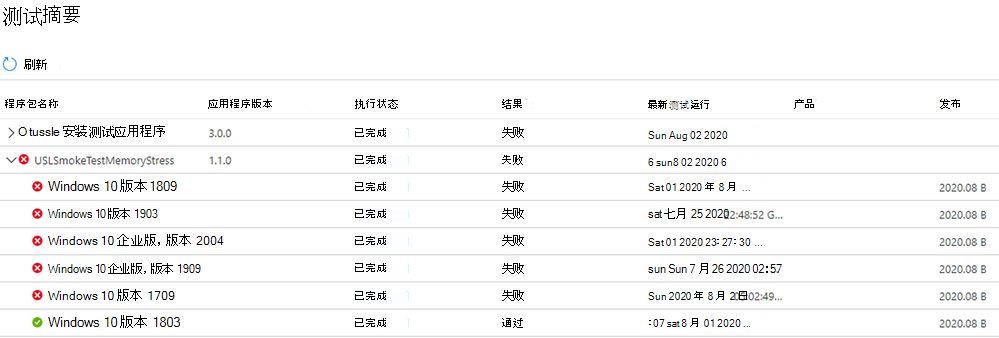

# <a name="memory-regression-analysis"></a><span data-ttu-id="9ecfd-103">内存回归分析</span><span class="sxs-lookup"><span data-stu-id="9ecfd-103">Memory Regression Analysis</span></span>

<span data-ttu-id="9ecfd-104">测试基础可帮助你更清楚地注意到运行应用的测试 VM 中的内存使用量显著增加。</span><span class="sxs-lookup"><span data-stu-id="9ecfd-104">Test Base helps you more clearly notice significant memory usage increases in the test VMs running your apps.</span></span> <span data-ttu-id="9ecfd-105">性能指标（如内存使用率）可以指示整体应用程序运行状况，我们认为此添加将大大有助于使应用保持最佳性能。</span><span class="sxs-lookup"><span data-stu-id="9ecfd-105">Performance metrics, such as memory usage, can be indicative of overall application health and we believe this addition will greatly help keep your apps performing optimally.</span></span>

<span data-ttu-id="9ecfd-106">阅读了解详细信息或观看此视频，快速了解最新改进。</span><span class="sxs-lookup"><span data-stu-id="9ecfd-106">Read on for more details or watch this video for a quick walk through of the latest improvements.</span></span> 

<span data-ttu-id="9ecfd-107">有关针对 M365 的 M365 能否帮助进行回归分析，请参阅基于过程可靠性的回归结果。</span><span class="sxs-lookup"><span data-stu-id="9ecfd-107">For more information on Test Base for M365's ability to help with regression analysis, see Regression results based on process reliability.</span></span>

<span data-ttu-id="9ecfd-108"><b>进一步了解内存回归</b></span><span class="sxs-lookup"><span data-stu-id="9ecfd-108"><b>Looking closer at memory regressions</b></span></span>

<span data-ttu-id="9ecfd-109">M365 测试基础仪表板显示应用程序在新的预发布 Windows 更新中使用的内存，并将其与上次发布的 Windows 更新使用的内存进行比较。</span><span class="sxs-lookup"><span data-stu-id="9ecfd-109">The Test Base for M365 dashboard shows the memory consumed by your application on a new pre-released Windows update and compares it with the memory used by the last released Windows update.</span></span> 

<span data-ttu-id="9ecfd-110">通过本月的增强功能，内存回归分析现在成为你最喜爱的流程中的一项功能。</span><span class="sxs-lookup"><span data-stu-id="9ecfd-110">With this month’s enhancements, memory regression analysis is now featured in your favorited processes.</span></span> <span data-ttu-id="9ecfd-111">应用程序可以包含多个进程，并且可以通过"可靠性"选项卡手动选择你最喜爱的进程。然后，我们的服务将识别这些收藏过程中的内存回归，同时跨不同的更新版本比较Windows运行。</span><span class="sxs-lookup"><span data-stu-id="9ecfd-111">Applications can contain multiple processes and you can manually select your favorite processes through the Reliability tab. Our service will then identify memory regressions in these favorited processes while comparing test runs across different Windows update releases.</span></span> <span data-ttu-id="9ecfd-112">如果检测到回归，则很容易获得有关回归的详细信息。</span><span class="sxs-lookup"><span data-stu-id="9ecfd-112">If a regression is detected, details about the regression are easily available.</span></span>

<span data-ttu-id="9ecfd-113">现在我们来看一下此功能，并讨论如何使用 Performance Analyzer 对内存回归进行Windows疑难解答。</span><span class="sxs-lookup"><span data-stu-id="9ecfd-113">Now let's look at this feature in detail and discuss how you can troubleshoot memory regressions using Windows Performance Analyzer.</span></span>

<span data-ttu-id="9ecfd-114">内存回归导致的失败信号显示在"测试结果"页的"内存使用率"下的"M365 测试基础"仪表板中：</span><span class="sxs-lookup"><span data-stu-id="9ecfd-114">The failure signal caused by a memory regression is shown in the Test Base for M365 dashboard on the Test results page under Memory Utilization:</span></span>


<span data-ttu-id="9ecfd-116">应用程序因内存消耗增加而失败，也将显示在"测试摘要"页上 ```Fail``` ：</span><span class="sxs-lookup"><span data-stu-id="9ecfd-116">Failure for the application due to higher memory consumption, will also be displayed as ```Fail``` on the Test Summary page:</span></span>



<span data-ttu-id="9ecfd-118">通过提前提供这些失败信号，我们的目标是明确标记可能干扰和影响应用程序最终用户体验的潜在问题。</span><span class="sxs-lookup"><span data-stu-id="9ecfd-118">By providing these failure signals upfront, our goal is to clearly flag potential issues that can disrupt and impact the end user experience for your application.</span></span> 

<span data-ttu-id="9ecfd-119">然后，您可以下载日志文件，并使用 Windows Performance Analyzer 或首选工具包进行进一步调查。</span><span class="sxs-lookup"><span data-stu-id="9ecfd-119">You can then download the log files and use the Windows Performance Analyzer, or your preferred toolkit, to investigate further.</span></span> <span data-ttu-id="9ecfd-120">还可以与 M365 测试基础团队一起修复问题并帮助防止影响最终用户的问题。</span><span class="sxs-lookup"><span data-stu-id="9ecfd-120">You can also work jointly with the Test Base for M365 team on remediating the issue and help prevent issues impacting end users.</span></span>

<span data-ttu-id="9ecfd-121">对于所有测试运行，内存信号在 M365 服务测试基础的"内存使用率"选项卡中捕获。</span><span class="sxs-lookup"><span data-stu-id="9ecfd-121">Memory signals are captured in the Memory Utilization tab in the Test Base for M365 service for all test runs.</span></span> <span data-ttu-id="9ecfd-122">下面的示例显示了针对预发布 2020 年 8 月安全更新的已载入应用程序"消耗测试内存压力"的最新测试运行。</span><span class="sxs-lookup"><span data-stu-id="9ecfd-122">The example below shows a recent test run with the onboarded application “Smoke Test Memory Stress” against the pre-release August 2020 security update.</span></span> <span data-ttu-id="9ecfd-123"> (本应用程序是团队为说明内存回归而编写的) </span><span class="sxs-lookup"><span data-stu-id="9ecfd-123">(This application was written by our team to illustrate memory regressions.)</span></span>


<span data-ttu-id="9ecfd-125">此示例中，与发布的 7 月更新相比，收藏的进程"USLTestMemoryStress.exe"过程在 8 月发布的更新中平均消耗了大约 100 MB，因此 M365 测试基础确定了一个回归。</span><span class="sxs-lookup"><span data-stu-id="9ecfd-125">In this example, the favorite process “USLTestMemoryStress.exe” process consumed an average of approximately 100 MB on the pre-release August update compared to the released July update, hence the Test Base for M365 identified a regression.</span></span> 

<span data-ttu-id="9ecfd-126">此处显示为"USLTestMemoryStress_Aux1.exe"和"USLTestMemoryStress_Aux2.exe"的其他进程也属于同一应用程序，但在两个版本中消耗的内存量大致相同，因此它们"通过"并被视为正常。</span><span class="sxs-lookup"><span data-stu-id="9ecfd-126">The other processes—shown here as “USLTestMemoryStress_Aux1.exe” and “USLTestMemoryStress_Aux2.exe”—also belong to the same application, but consumed approximately the same amount of memory for the two releases so they "passed" and were considered healthy.</span></span>

<span data-ttu-id="9ecfd-127">主要过程的回归被确定为"统计显著"，因此服务向用户传达并突出显示了此差异。</span><span class="sxs-lookup"><span data-stu-id="9ecfd-127">The regression on the main process was determined to be “statistically significant” so the service communicated and highlighted this difference to the user.</span></span> <span data-ttu-id="9ecfd-128">如果比较在统计上没有意义，将不会突出显示。</span><span class="sxs-lookup"><span data-stu-id="9ecfd-128">If the comparison was not statistically significant, it would not be highlighted.</span></span> <span data-ttu-id="9ecfd-129">内存使用率可能很干扰，因此，我们使用统计模型来区分内部版本和版本之间的有意义的差异与非必要差异。</span><span class="sxs-lookup"><span data-stu-id="9ecfd-129">Memory utilization can be noisy, so we use statistical models to distinguish, across builds and releases, meaningful differences from inconsequential differences.</span></span> 

<span data-ttu-id="9ecfd-130">当误报 (没有真正的差异时，很少标记比较) 但这是一个必要的权衡，以提高正确识别回归 (或真正的正数的可能性。) </span><span class="sxs-lookup"><span data-stu-id="9ecfd-130">A comparison may rarely be flagged when there is no true difference (a false positive), but this is a necessary tradeoff to improve the likelihood of correctly identifying regressions (or true positives.)</span></span>

<span data-ttu-id="9ecfd-131">下一步是了解导致内存回归的原因。</span><span class="sxs-lookup"><span data-stu-id="9ecfd-131">The next step is to understand what caused the memory regression.</span></span> <span data-ttu-id="9ecfd-132">可以从"下载日志文件"选项下载执行这两个文件的 zip 文件，如下所示。</span><span class="sxs-lookup"><span data-stu-id="9ecfd-132">You can download the zip files for both executions from the Download log files option, as shown below.</span></span> 

<span data-ttu-id="9ecfd-133">这些 zip 文件包含测试运行的结果，包括脚本结果以及 ETL 文件中包含的内存和 CPU 性能数据。</span><span class="sxs-lookup"><span data-stu-id="9ecfd-133">These zip files contain the results of your test run, including script results and memory and CPU performance data which is included in the ETL file.</span></span>


<span data-ttu-id="9ecfd-135">您可以下载并解压缩两个测试运行的日志，然后找到每个文件夹中的 ETL 文件，并将其重命名为 target.etl (以用于预发布更新) 上的测试运行，将 baseline.etl (用于上次发布的更新) 上的测试运行，以简化探索和导航。</span><span class="sxs-lookup"><span data-stu-id="9ecfd-135">You can download and unzip the logs for the two test runs, then locate the ETL file within each folder and rename them as target.etl (for the test run on the pre-release update) and baseline.etl (for the test run on last released update) to simplify exploration and navigation.</span></span>
 
## <a name="next-steps"></a><span data-ttu-id="9ecfd-136">后续步骤</span><span class="sxs-lookup"><span data-stu-id="9ecfd-136">Next steps</span></span>

<span data-ttu-id="9ecfd-137">继续阅读下一篇文章，开始了解智能 CPU 回归分析。</span><span class="sxs-lookup"><span data-stu-id="9ecfd-137">Advance to the next article to get started with understanding intelligent CPU regression analysis.</span></span>
> [!div class="nextstepaction"]
> [<span data-ttu-id="9ecfd-138">后续步骤</span><span class="sxs-lookup"><span data-stu-id="9ecfd-138">Next step</span></span>](cpu.md)

<!---
Add button for next page
-->
