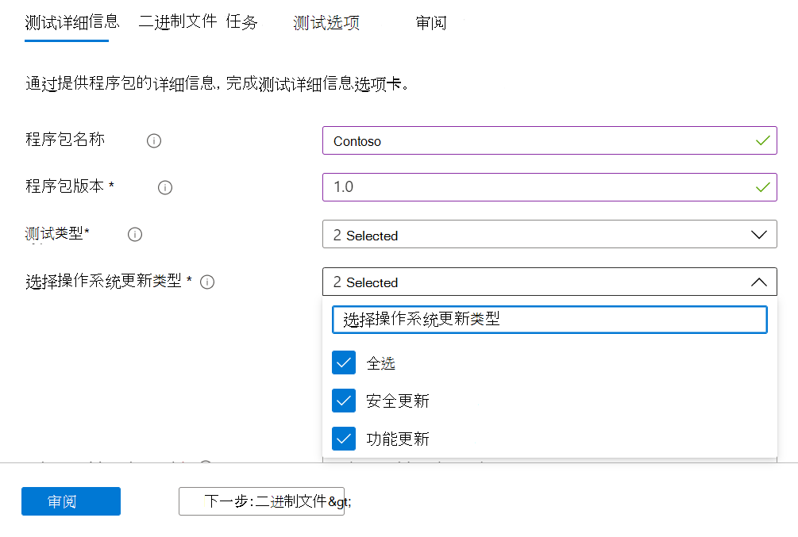

# <a name="step-2-uploading-a-package"></a><span data-ttu-id="c141b-103">步骤 2：上载程序包</span><span class="sxs-lookup"><span data-stu-id="c141b-103">Step 2: Uploading a Package</span></span>

<span data-ttu-id="c141b-104">在"测试基础门户"页上，导航到左侧导航栏上的"Upload新程序包"选项，如下所示：Upload </span><span class="sxs-lookup"><span data-stu-id="c141b-104">On the Test Base portal page, navigate to the ‘Upload new package option on the left navigation bar as shown below: </span></span>

<span data-ttu-id="c141b-105">完成后，请按照以下步骤上载新程序包。</span><span class="sxs-lookup"><span data-stu-id="c141b-105">Once there, follow the steps below to upload a new package.</span></span>

## <a name="enter-details-for-your-package"></a><span data-ttu-id="c141b-106">输入程序包的详细信息</span><span class="sxs-lookup"><span data-stu-id="c141b-106">Enter details for your package</span></span>

<span data-ttu-id="c141b-107">在"测试详细信息"选项卡上，键入程序包的名称、版本和其他详细信息（如所请求）。</span><span class="sxs-lookup"><span data-stu-id="c141b-107">On the Test details tab, type in your package's name, version and other details as requested.</span></span> 

<span data-ttu-id="c141b-108">**可通过此仪表板** 完成开箱即用和功能测试。</span><span class="sxs-lookup"><span data-stu-id="c141b-108">**Out-of-Box** and **Functional testing** can be done via this dashboard.</span></span>

<span data-ttu-id="c141b-109">以下步骤提供了如何填写程序包详细信息的指南：</span><span class="sxs-lookup"><span data-stu-id="c141b-109">The steps below provides a guide on how to fill out your package details:</span></span>

1.  <span data-ttu-id="c141b-110">**在 字段中输入要给定程序包 ```“Package name``` 的名称。**</span><span class="sxs-lookup"><span data-stu-id="c141b-110">**Enter the name to be given your package in the ```“Package name``` field.**</span></span>

> [!Note]  
> <span data-ttu-id="c141b-111">输入的程序包名称和版本组合在组织中必须是唯一的。</span><span class="sxs-lookup"><span data-stu-id="c141b-111">The package name and version combination entered must be unique within your organization.</span></span> <span data-ttu-id="c141b-112">检查标记对此进行验证，如下所示。</span><span class="sxs-lookup"><span data-stu-id="c141b-112">This is validated by the checkmark as shown below.</span></span>
  
  - <span data-ttu-id="c141b-113">如果选择重新使用程序包的名称，则版本号必须是唯一的 (即从不用于包含该特定名称的程序包) 。</span><span class="sxs-lookup"><span data-stu-id="c141b-113">If you choose to re-use an package's name, then the version number must be unique (i.e. never been used with an package bearing that particular name).</span></span>
  - <span data-ttu-id="c141b-114">如果程序包名称 + 版本的组合未通过唯一性检查，你将看到一条错误消息，显示"程序包 *包含此程序包版本已存在"。*</span><span class="sxs-lookup"><span data-stu-id="c141b-114">If the combination of the package name + version does not pass the uniqueness check, you will see an error message which reads, *“Package with this package version already exists”*.</span></span> 


2. <span data-ttu-id="c141b-116">**在"程序包版本"字段中输入版本。**</span><span class="sxs-lookup"><span data-stu-id="c141b-116">**Enter a version in the “Package version” field.**</span></span>


3.  <span data-ttu-id="c141b-118">**选择要在此程序包上运行的测试类型**</span><span class="sxs-lookup"><span data-stu-id="c141b-118">**Select the type of test you want to run on this package**</span></span>

    <span data-ttu-id="c141b-119">开 **箱即用 OOB (OOB)\*\*\*测试执行程序包* 的安装、启动、*关闭\* 和卸载。</span><span class="sxs-lookup"><span data-stu-id="c141b-119">An **Out-of-Box (OOB)** test performs an *install*, *launch*, *close* and *uninstall* of your package.</span></span> <span data-ttu-id="c141b-120">安装后，在运行单个卸载之前，launch-close 例程将重复 30 次。</span><span class="sxs-lookup"><span data-stu-id="c141b-120">After the install, the launch-close routine is repeated 30 times before a single uninstall is run.</span></span> 
    
    <span data-ttu-id="c141b-121">此 OOB 测试提供了程序包上的标准化遥测，可跨内部版本Windows比较。</span><span class="sxs-lookup"><span data-stu-id="c141b-121">This OOB test provides you with standardized telemetry on your package to compare across Windows builds.</span></span>

    <span data-ttu-id="c141b-122">功能 **测试** 将在程序包上执行 () 脚本。</span><span class="sxs-lookup"><span data-stu-id="c141b-122">A **Functional test** would execute your uploaded test script(s) on your package.</span></span> <span data-ttu-id="c141b-123">脚本按上载顺序运行，特定脚本中的失败将停止后续脚本的执行。</span><span class="sxs-lookup"><span data-stu-id="c141b-123">The scripts are run in upload sequence and a failure in a particular script will stop subsequent scripts from executing.</span></span>

> [!Note]
> <span data-ttu-id="c141b-124">**所有** 脚本最多运行 80 分钟。</span><span class="sxs-lookup"><span data-stu-id="c141b-124">**All** scripts run for 80 minutes at the most.</span></span> 
    
4.  <span data-ttu-id="c141b-125">**选择操作系统更新类型**</span><span class="sxs-lookup"><span data-stu-id="c141b-125">**Select the OS update type**</span></span>

   - <span data-ttu-id="c141b-126">通过"安全更新"，可以针对预发布每月安全更新中Windows增量改动测试程序包。</span><span class="sxs-lookup"><span data-stu-id="c141b-126">The ‘Security updates’ enables your package to be tested against incremental churns of Windows pre-release monthly security updates.</span></span> 
   - <span data-ttu-id="c141b-127">利用"功能更新"，可以针对预览体验计划Windows预发布两年功能更新版本测试Windows程序包。</span><span class="sxs-lookup"><span data-stu-id="c141b-127">The ‘Feature updates’ enables your package to be tested against Windows pre-release bi-annual feature updates builds from the Windows Insider Program.</span></span>
<!---
Change to the correct picture
-->


5.  <span data-ttu-id="c141b-129">**选择用于安全更新 () 操作系统版本。**</span><span class="sxs-lookup"><span data-stu-id="c141b-129">**Select the OS version(s) for Security update tests.**</span></span>

<span data-ttu-id="c141b-130">在多选下拉列表中， (安装) Windows选择操作系统版本。</span><span class="sxs-lookup"><span data-stu-id="c141b-130">In the multi-select dropdown, select the OS version(s) of Windows your package will be installed on.</span></span> 

  - <span data-ttu-id="c141b-131">若要仅针对客户端WINDOWS测试程序包，请从Windows列表中选择适用的 11 操作系统版本。</span><span class="sxs-lookup"><span data-stu-id="c141b-131">To test your package against Windows Client OSes only, select the applicable Windows 11 OS versions from the menu list.</span></span>
  - <span data-ttu-id="c141b-132">若要仅针对 Windows OSes 测试程序包，请从Windows列表中选择适用的服务器操作系统版本。</span><span class="sxs-lookup"><span data-stu-id="c141b-132">To test your package against Windows Server OSes only, select the applicable Windows Server OS versions from the menu list.</span></span>
  - <span data-ttu-id="c141b-133">若要针对客户端和Windows OSes 测试程序包，请从菜单列表中选择所有适用的 OSes。</span><span class="sxs-lookup"><span data-stu-id="c141b-133">To test your package against Windows Client and Server OSes, select all applicable OSes from the menu list.</span></span> 

> [!Note]
> <span data-ttu-id="c141b-134">如果选择针对服务器和客户端 OSes 测试程序包，请确保程序包兼容，并且可在两个 OSes 上运行</span><span class="sxs-lookup"><span data-stu-id="c141b-134">If you select to test your package against both Server and Client OSes, please make sure that the package is compatible and can run on both OSes</span></span>


<!---
Change to the correct picture
-->
6.  <span data-ttu-id="c141b-136">**选择功能更新测试的选项：**</span><span class="sxs-lookup"><span data-stu-id="c141b-136">**Select options for Feature update tests:**</span></span>

  - <span data-ttu-id="c141b-137">在"选择预览体验成员频道"选项上，选择 作为应针对其测试程序包 ```Windows Insider Program Channel``` 的内部版本。</span><span class="sxs-lookup"><span data-stu-id="c141b-137">On the option to “Select Insider Channel”, select the ```Windows Insider Program Channel``` as the build which your packages should be tested against.</span></span>
  
    <span data-ttu-id="c141b-138">我们目前使用预览体验成员 Beta 渠道中测试的内部版本。</span><span class="sxs-lookup"><span data-stu-id="c141b-138">We currently use builds flighted in the Insider Beta Channel.</span></span>

  - <span data-ttu-id="c141b-139">在"为 Insight 选择操作系统基线"选项上，Windows用作比较测试结果基线的 os 版本。</span><span class="sxs-lookup"><span data-stu-id="c141b-139">On the option to “Select OS baseline for Insight”, select the Windows OS version to be used as a baseline in comparing your test results.</span></span> 

> [!Note]
> <span data-ttu-id="c141b-140">目前我们不支持服务器 OSes 的功能更新测试</span><span class="sxs-lookup"><span data-stu-id="c141b-140">We DO NOT support Feature update testing for Server OSes at this time</span></span>
<!---
Note to actual note format for markdown
-->
<!---
Change to the correct picture
-->


7.  <span data-ttu-id="c141b-142">完成的"测试详细信息"页应如下所示：</span><span class="sxs-lookup"><span data-stu-id="c141b-142">A completed Test details page should look like this:</span></span> 


## <a name="next-steps"></a><span data-ttu-id="c141b-144">后续步骤</span><span class="sxs-lookup"><span data-stu-id="c141b-144">Next steps</span></span>

<span data-ttu-id="c141b-145">我们的下一篇文章介绍了将二进制文件上载到系统。</span><span class="sxs-lookup"><span data-stu-id="c141b-145">Our next article covers Uploading your Binaries to our serivce.</span></span>
> [!div class="nextstepaction"]
> [<span data-ttu-id="c141b-146">后续步骤</span><span class="sxs-lookup"><span data-stu-id="c141b-146">Next step</span></span>](binaries.md)

<!---
Add button for next page
-->

